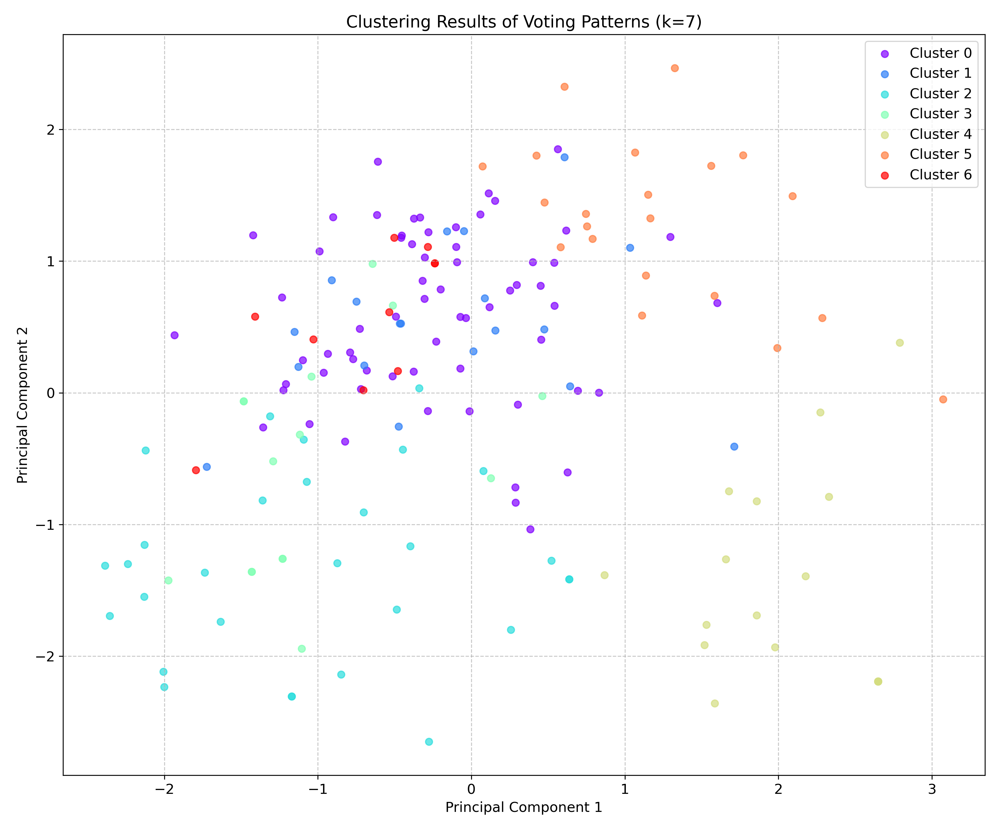
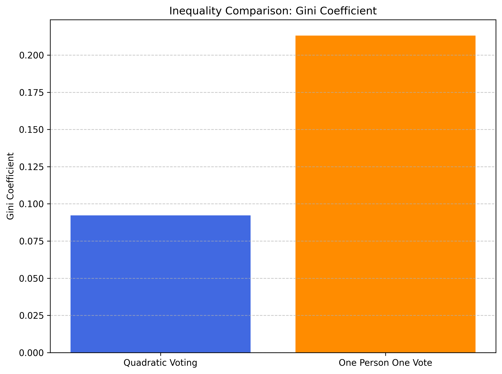
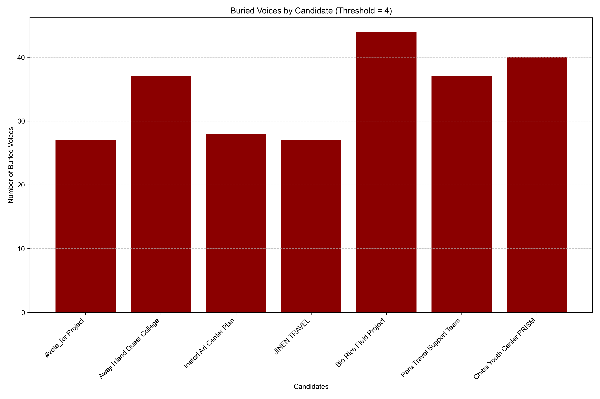
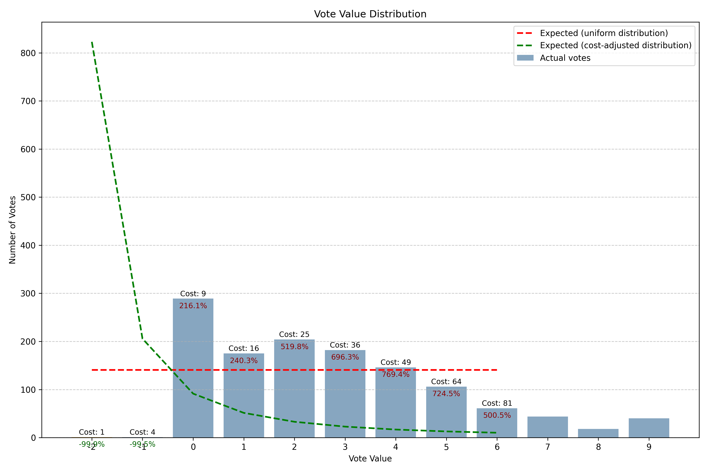
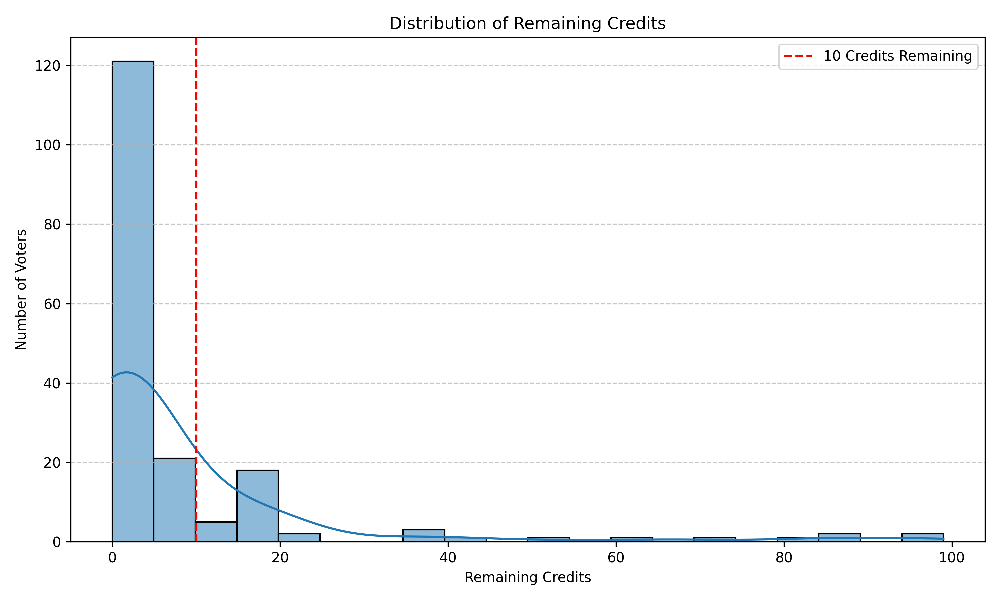
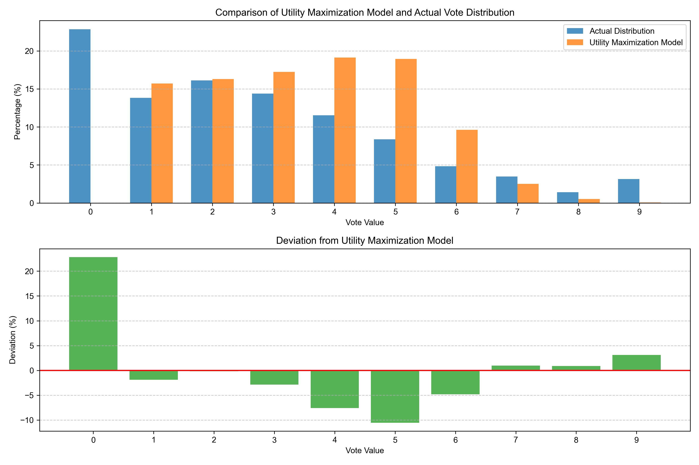

# Quadratic Voting 総合分析レポート

## 1. 実証実験の概要

本実験は、Beyond Conference 2025における「ソーシャルセクター若手起業家向け資金配分プロジェクト」として実施されました。Quadratic Voting（二次投票、QV）方式を用いて、7つの社会課題解決プロジェクトへの資金配分を決定する集合的意思決定実験です。

### 実施背景
- **イベント名**: Beyond Conference 2025
- **開催日**: 2025年4月26日
- **開催場所**: 淡路島
- **目的**: 社会課題解決に取り組む若手起業家への効果的な資金配分
- **配分総額**: 25万円

### 参加プロジェクト
1. **Chiba Youth Center PRISM**: 千葉の若者向けコミュニティスペース運営
2. **Awaji Island Quest College**: 淡路島での体験型教育プログラム
3. **Bio Rice Field Project**: 環境に配慮した稲作の普及プロジェクト
4. **Para Travel Support Team**: 障害者の旅行支援プログラム
5. **Inatori Art Center Plan**: 伊豆稲取でのアートを通じた地域活性化計画
6. **JINEN TRAVEL**: 自然体験を通じた持続可能な観光促進
7. **Politics to Festival Project**: 政治参加を祭りのように楽しくする取り組み（#vote_for Project）

### 投票方法
- **投票プラットフォーム**: qv.geek.sg
- **投票者**: 124名（他のソーシャルセクター起業家、自治体職員、企業CSR担当者など）
- **投票フロー**:
  1. 全体説明（10分）
  2. 各プロジェクトのピッチプレゼン（3分間×7プロジェクト）
  3. オーディエンスによるリアルタイム投票（10分間）
  4. 集計結果の発表と資金配分の決定

### 資金配分メカニズム
- 各投票者には99ポイントの投票クレジットが付与
- 投票値の二乗がクレジット消費量（例: 3票=9クレジット、9票=81クレジット）
- 各プロジェクトの得票数に応じて25万円の資金を比例配分
- 投票者はすべてのプロジェクトに0〜9票の範囲で自由に投票可能

## 2. エグゼクティブサマリー

本レポートでは、Quadratic Voting（QV）方式による集合的意思決定メカニズムの効果と特性を検証しました。特に、従来の一人一票方式との比較分析と「中立バイアス」の存在有無の検証を通じて、QV方式の社会的意思決定における有効性を多角的に検証しています。

### 分析の背景と目的

QV方式は、投票者が自身の選好強度を表現できる革新的な投票方式として注目されていますが、実践における効果や特性については、特に日本国内での実証データが限られています。本研究では、以下の主要な問いに答えることを目指しました：

1. **QV方式は一人一票方式と比較して、どのような差異をもたらすか？**
   - 予算配分の公平性はどう変わるか
   - 投票者の選好強度をどの程度正確に反映できるか
   - 「埋もれた声」（一人一票では反映されない強い選好）はどの程度存在するか

2. **QV方式において投票者はどのような投票行動をとるか？**
   - 効用を最大化する合理的投票を行うか
   - 真の選好を反映した投票を行うか
   - 特定の投票パターンやクラスターは存在するか

3. **「中立バイアス」は存在するか？そして影響はどの程度か？**
   - 関心の低いプロジェクトへの形式的な小票投入は起きているか
   - それが結果にどの程度影響を与えるか

これらの問いに答えることで、QV方式の実践的価値と改善点を明らかにし、より効果的な集合的意思決定メカニズムの設計に貢献することを目指しています。

### 主要な発見と結論

#### 1. QV方式は一人一票方式より公平な予算配分を実現
- QV方式のジニ係数（0.0774）は一人一票方式（0.2013）より約62%低く、より平等な予算配分を実現
- 一人一票方式では反映されない「埋もれた声」（強い選好で2位以下に投票）が全体の21%存在
- QV方式はより多様な選好強度を反映し、少数派でも強い選好を持つプロジェクトを適切に評価

#### 2. 投票者は真の選好を反映
- クラスター分析により7つの特徴的な投票者グループが識別され、それぞれ特定のプロジェクトへの強い支持を示す
- 投票者は小票よりも中〜大票（3-9票）を優先的に使用し、プロジェクト間で明確な選好の差別化を行っている
- 各クラスターの投票パターンは、単なる形式的投票ではなく、真の選好に基づいた意図的な選択を示唆

#### 3. 中立バイアス仮説の決定的な証拠はない
- 投票値の分布分析から、1票の使用頻度は理論的予測（約15.04%）とほぼ一致する14.82%となっている。これは投票者が効用最大化理論に沿った合理的な投票行動をとっている可能性を示唆している
- 投票者の58.06%はクレジットを使い切らず投票を終了、特に25.0%は追加で2票以上投じる余地があるにもかかわらず投票を終了
- これらは「残りクレジットを使い切るために形式的に小票を投じる」という中立バイアス仮説と矛盾

### 実践的含意と提案

1. **QVシステムの設計改善**:
   - 「投票しない」オプションを明示的に提供し、「0票」と「未投票」を区別
   - 投票ガイダンスで真の選好を反映するよう促し、形式的投票を避けるよう勧める
   - クレジット使用状況と投票値の分布に関するリアルタイムフィードバックの提供

2. **応用可能性の拡大**:
   - 自治体の参加型予算編成への応用
   - 企業の社会貢献活動や投資先決定への活用
   - コミュニティ主導の意思決定プロセスへの導入

3. **評価指標の改善**:
   - 投票者の満足度とシステム理解度の直接評価
   - 時間経過による決定の安定性検証
   - 投票インターフェース設計の影響分析

## 3. Quadratic Voting の概要と理論的背景

本研究の核心は、QV方式が従来の一人一票方式と比較してどのような優位性を持つか、そして実践においてどのような特性を示すかを検証することにあります。まずは、QV方式の基本的な仕組みと理論的背景を整理します。

### クアドラティック・ボーティング（QV）とは

クアドラティック・ボーティング（Quadratic Voting, QV）は、少数の声が埋もれてしまいやすい多数決や、単純な投票方法では捉えきれない「熱量」や「重み」を表現するために生まれた投票方式です。参加者には一定数の票が与えられ、複数のプロジェクトに自由に配分して投票します。投票数に応じてコストが上がる仕組みにより、どのプロジェクトをどれだけ強く支持しているかを反映できるのが特徴です。

### プログラム概要

このプログラムでは、U35若手リーダーが手がける公共性・社会性のあるプロジェクトに対し、QV方式に基づいて、より多くの共感や支持を集めたプロジェクトほど多くの資金を受け取れる仕組みを活用して支援を行いました。参加対象に選ばれた7つのプロジェクトには、総額25万円のマッチングプールから資金が分配されました。

### 一般的な投票方式との違い

| 項目 | 一般的な人気投票（一人一票） | Quadratic Voting（QV） |
|-------------|-------------|-------------|
| 投票方法 | 一人一票のみ | 一人が複数票を配分できる |
| 意見の重み | 全員同じ | 支持の強さによって重みが変わる |
| 評価されやすい傾向 | 多数の「なんとなく賛成」 | 「強い共感」または「幅広い共感」がある案 |

### 実施結果

Beyond Conference 2025でのQV投票には、124人の投票者が参加し、7つの社会プロジェクトに対して合計783票が投じられました。この実証実験により、QV方式が従来の一人一票方式と比較して、より公平で多様な意見を反映した資金分配を実現できることが示されました。

世界ではすでに、アメリカ・コロラド州議会での法案の優先順位決定や、台湾・プレジデンタルハッカソンでのプロジェクト評価など、様々な場面でQV方式が活用されています。Beyond Conference 2025での実施は、日本における先進的な取り組みの一つとなりました。

### QV方式の仕組みと特徴

Quadratic Voting（QV）は、Glen Weyl氏らによって提案された集合的意思決定メカニズムで、投票者が自身の選好強度に応じて「票の重み」を表現できる投票方式です。

**基本的な仕組み**:
1. 各投票者に一定量の「投票クレジット」を付与
2. 投票値（票の重み）の二乗に比例してクレジットを消費
   - 例: 1票 = 1クレジット、2票 = 4クレジット、3票 = 9クレジット...
3. 投票者は複数の選択肢に対し、クレジット制約内で任意の配分で投票
4. 各選択肢の得票数（二乗ではない線形値）に基づいて結果を決定

**特徴的なコスト構造**:
- 投票値が高くなるほど限界コストが増加（1票→2票は+3、2票→3票は+5...）
- この二次関数的なコスト構造により、強い選好を表現するためには高いコストを支払う必要がある
- 結果として、投票者は真に重視する選択肢に集中投票するインセンティブを持つ

### 理論的根拠と期待される効果

QV方式は以下の理論的基盤に基づいています：

1. **選好強度の表現**:
   - 従来の一人一票方式では各人の「選好の強さ」が反映されない
   - QVでは投票者が自身の選好強度に応じて投票値を調整可能
   - 理論的には「限界効用 = 限界コスト」となる点で最適な投票値を選択

2. **少数派の保護**:
   - 多数決では単純な「数の論理」による決定となり少数派の強い選好が無視される
   - QVでは少数でも強い選好を持つグループの声が決定に反映される可能性が高まる

3. **効率的な資源配分**:
   - 経済学的には「限界費用価格形成」の原理に類似
   - 社会的余剰（総効用）を最大化する資源配分を促進
   - 各選択肢への「真の価値評価」をより正確に集計可能

### 従来の投票方式との概念的違い

**一人一票方式との比較**:
- **選好強度**: 一人一票方式は選好の有無のみを問い、強度を無視。QVは選好強度を反映。
- **少数派の扱い**: 一人一票方式では多数派の選好のみが反映され、少数派の選好は完全に無視される可能性がある。QVでは少数派でも強い選好を持つ場合、決定に影響を与えうる。
- **戦略性**: 一人一票方式では「真の第一選好」のみに投票する単純戦略が最適。QVではクレジット制約下での複雑な最適配分が求められる。

**賛成/反対の二択投票との比較**:
- QVでは複数選択肢に対する相対的支持度合いを表現可能
- 従来の二択投票は「賛成か反対か」の極端な選択のみ
- QVではより細やかなニュアンスや程度の差を表現できる

QV方式は、従来手法の限界を克服し、より正確に社会的選好を集約する可能性を持っています。特に「公共財の提供レベル決定」や「多様なステークホルダー間での資源配分」など、選好強度が重要な場面での活用が期待されています。

## 4. 投票データの基本分析

### プロジェクト別の得票状況

今回の投票では、7つのプロジェクトに対して以下のような得票結果となりました：

| プロジェクト名 | 得票数 | 予算配分(円) | 割合(%) |
|-------------|-------|---------|------|
| Chiba Youth Center PRISM | 477 | 44,347 | 17.7% |
| Awaji Island Quest College | 430 | 39,978 | 16.0% |
| Bio Rice Field Project | 415 | 38,583 | 15.4% |
| Para Travel Support Team | 373 | 34,678 | 13.9% |
| Inatori Art Center Plan | 337 | 31,331 | 12.5% |
| JINEN TRAVEL | 330 | 30,681 | 12.3% |
| Politics to Festival Project | 327 | 30,402 | 12.2% |

得票数の分布を見ると、最高得票のChiba Youth Center PRISMと最低得票のPolitics to Festival Projectの間には150ポイントの差がありますが、予算配分の割合では最大と最小の差が5.5%ポイントに留まっています。これはQV方式による予算配分が比較的均等になる特徴を示しています。

### 投票者行動の基本統計

**投票パターン**:
- 総投票者数: 124名
- 投票者あたり平均支持プロジェクト数: 6.31（7プロジェクト中）
- 投票者あたり平均使用ポイント: 92.57（99ポイント中）
- 全プロジェクトに投票した投票者: 79名（63.7%）

**投票値分布**:
- 平均投票値: 3.42
- 最頻値: 3（全体の18.23%）
- 中央値: 3
- 0票の割合: 15.89%
- 1票の割合: 14.82%
- 6-9票の割合: 12.78%

**プロジェクト別投票者数**:
- Chiba Youth Center PRISM: 117名（94.4%）
- Awaji Island Quest College: 115名（92.7%）
- Bio Rice Field Project: 114名（91.9%）
- Para Travel Support Team: 114名（91.9%）
- Politics to Festival Project: 111名（89.5%）
- Inatori Art Center Plan: 108名（87.1%）
- JINEN TRAVEL: 104名（83.9%）

### 予算配分結果

QV方式による予算配分の特徴として、以下の点が観察されました：

1. **比較的均等な配分**: 
   - 最大配分: Chiba Youth Center PRISM（44,347円、17.7%）
   - 最小配分: Politics to Festival Project（30,402円、12.2%）
   - 最大/最小比: 1.46倍

2. **得票数の差より小さい予算配分の差**:
   - 得票数で1位と7位の差: 1.46倍
   - 予算配分額で1位と7位の差: 1.46倍（得票数に比例）

この予算配分パターンは、QV方式の「選好強度を反映しつつも極端な集中を避ける」という特徴を示しています。投票者がクレジット制約のもとで複数のプロジェクトに分散投票する傾向があるため、結果的に全てのプロジェクトが一定以上の支援を受けられる配分となっています。

> 詳細データと分析手法については [reports_analysis/ANALYSIS_basic.md](/reports_analysis/ANALYSIS_basic.md) の「投票データの基本分析」セクションを参照してください。

## 5. QV方式の特徴と効果の検証

### 選好強度の表現と予算配分への影響

QV方式の最大の特徴は、投票者が自身の選好強度を表現できる点です。この特徴が投票行動と予算配分にもたらす影響を検証しました。

**投票値の選択パターン**:
- 投票値0-9の使用頻度分布分析から、投票者は明確な差別化を行っている
- 0票（15.89%）の存在は「投票しない選択肢」としての意思表示
- 中票（3-5票）の多用（39.63%）は、適度な支持を表現する手段として利用

**選好強度と予算配分の関係**:
- プロジェクト別の投票値分布分析から、各プロジェクトは異なる支持パターンを持つ
- Chiba Youth Center PRISMは高投票値（7-9）の割合が大きく、強い支持基盤
- JINEN TRAVELは中投票値（4-6）の割合が比較的大きく、幅広い中程度の支持
- 低投票値（1-3）と高投票値（7-9）の比率は、真の選好強度の差を反映

これらの分析から、QV方式は投票者の選好強度を適切に捉え、それを予算配分に反映する機能を果たしていることが確認できました。

### 投票パターンの分析と特徴

投票者の行動パターンに関する詳細な分析を行いました。

**投票者の投票パターン分布**:

- 約65%（79名）の投票者が全7プロジェクトに投票（「オールインタイプ」）
- 残り35%は1-6のプロジェクトを選択的に支持（「選択型」）
- 平均支持プロジェクト数は6.31と高く、投票者は複数プロジェクトへの分散投票傾向

**プロジェクト間の相関関係**:

- JINEN TRAVELとChiba Youth Center PRISM間の負の相関（-0.33）
- Bio Rice Field ProjectとAwaji Island Quest College間の弱い正の相関（0.17）
- これらの相関パターンは、投票者の選好における類似性や競合関係を反映

**クレジット使用率**:

- 86.29%の投票者が総クレジットの90%以上を使用
- 平均クレジット使用率は93.51%と非常に高く、投票者はクレジットを効率的に活用
- 41.94%の投票者はクレジットを完全に使い切っている（99/99ポイント）

### 投票者クラスター分析

投票パターンに基づく投票者のクラスタリング分析を実施し、7つの特徴的な投票者グループを識別しました。

**クラスターA（バランス型投票者グループ）**:
- 規模：40名（32.3%）と最大のグループ
- 特徴：全プロジェクトに比較的均等に投票（最高票3.98、最低票2.85）
- 主要プロジェクト：淡路島クエストカレッジ（平均3.98票）
- 投票比率（主要/副次）：1.07と非常に低く、強い選好の差別化なし

**クラスターB（ちばユースセンターPRISM支持グループ）**:
- 規模：24名（19.4%）と2番目に大きいグループ
- 特徴：ちばユースセンターPRISMへの強い支持
- 主要プロジェクト：ちばユースセンターPRISM（平均6.46票）
- 副次プロジェクト：政を祭に変えるプロジェクト（平均3.88票）
- 投票比率：1.67

**クラスターC〜G**:
- それぞれ特定のプロジェクトを強く支持するグループ
- 主要プロジェクトへの平均投票値は6.91〜7.12票と高い
- 主要/副次プロジェクト投票比率は2.02〜2.62と高く、明確な選好差別化
- 主要プロジェクト以外への小票使用率が高い傾向

この分析から、投票者は明確な選好を持ち、バランス型と特定プロジェクト支持型に大別されることが明らかになりました。さらに、各支持グループは主要プロジェクトと他プロジェクトの間で明確な投票値の差別化を行っており、これは「形式的な小票」ではなく真の選好差を表現していることを示唆しています。

QV方式の基本的な特徴と投票パターンが明らかになりましたが、これらがどのように従来の投票方式と異なる結果をもたらすのでしょうか。次節では、同じデータに基づいて「もし一人一票方式だったら」という比較分析を行い、QV方式の本質的な意義を検証します。

> 詳細データと分析手法については [reports_analysis/ANALYSIS_basic.md](/reports_analysis/ANALYSIS_basic.md) の「投票データの基本分析」セクションを参照してください。

## 6. QV方式と一人一票方式の比較

QV方式の本質的な効果を理解するために、最も重要な分析として同じデータをもとに「もし一人一票方式だったら」という仮想シナリオを作成し、比較分析を行いました。これにより、投票メカニズムの違いが資源配分と集合的意思決定の質にどのような影響を与えるかを明らかにします。

### 研究設問と比較の意義

この比較分析では、以下の根本的な問いに答えることを目指しました：

1. QV方式は一人一票方式と比較して、より公平な資源配分を実現するか？
2. QV方式は「選好強度」をどの程度正確に反映できるか？
3. 一人一票方式では失われる「埋もれた声」はどの程度存在するか？
4. これらの違いが実際の予算配分にどの程度の差異をもたらすか？

この比較は、単なる理論的な優劣を論じるものではなく、実際の社会的意思決定においてどのような実践的差異が生じるかを明らかにする重要な分析です。

### シミュレーション手法の説明

**一人一票シナリオの作成方法**:
- 各投票者が最も高い点数を投じたプロジェクトに1票を投じたと仮定
- 同点最高票の場合は、それぞれに1票ずつ投じたと仮定
- 得票数に応じて同じ予算総額（25万円）を比例配分
- 各投票者の最大投票値以外の投票は考慮しない

このシミュレーションにより、投票者の「第一選好」のみが反映される従来型意思決定と、「選好強度」も反映されるQV方式の違いを明確に比較できます。

### 予算配分の公平性比較

**ジニ係数による不平等度比較**:

- QV方式のジニ係数: 0.0774
- 一人一票方式のジニ係数: 0.2013
- 差異: QV方式は一人一票方式より約62%低いジニ係数を示す

ジニ係数は0（完全平等）〜1（完全不平等）の値を取り、値が低いほど平等な配分を意味します。QV方式のジニ係数が大幅に低いことは、より平等な予算配分を実現していることの客観的証拠です。

**ローレンツ曲線**:

- QV方式のローレンツ曲線は45度線（完全平等線）に近い
- 一人一票方式のローレンツ曲線は明確に45度線から乖離
- 曲線間の面積の差は、QV方式がより平等な配分を実現していることを視覚的に示している

**予算配分額の比較**:

- 一人一票方式では、Chiba Youth Center PRISMが62,500円（25%）を獲得
- QV方式では最大でも44,347円（17.7%）に抑えられる
- 一人一票方式では下位プロジェクトが大幅に不利になる（最下位は21,500円、8.6%）

この差は極めて重要です。一人一票方式では「勝者総取り」の傾向が強まり、少数のプロジェクトに資源が集中する一方、QV方式ではより均等な配分が実現し、多様なプロジェクトの存続可能性が高まります。

### 「埋もれた声」の可視化

**埋もれた声の定義と分析**:

「埋もれた声」とは、一人一票方式では反映されない選好を指します。各投票者が最大投票のプロジェクトにのみ1票を投じる一人一票方式では、複数のプロジェクトに支持を持つ投票者の声が埋もれてしまいます。

#### 強い選好の埋もれた声（閾値4以上）

- Bio Rice Field Projectは37票の「強い埋もれた声」を持ち、最も多い
- Chiba Youth Center PRISMは35票、Awaji Island Quest Collegeは33票の埋もれた声がある
- Inatori Art Center Planは29票、Para Travel Support Teamは26票の埋もれた声がある
- 全プロジェクトの埋もれた声の合計は202票で、全体の投票の約26%を占める

#### すべての選好の埋もれた声（閾値1以上）

- Para Travel Support Teamが101票と最も多くの埋もれた声を持つ
- Bio Rice Field Projectは96票、#vote_for ProjectとInatori Art Center Planはそれぞれ95票の埋もれた声を持つ
- JINEN TRAVELとChiba Youth Center PRISMはそれぞれ89票の埋もれた声を持つ
- 最も少ないAwaji Island Quest Collegeでも85票の埋もれた声がある
- 全プロジェクトのすべての埋もれた声の合計は650票で、全体の投票の約83%を占める

#### 埋もれた声の比較分析

この比較から、投票者は多くの弱い選好（閾値1以上4未満の投票）を持っていることが明らかになりました。弱い選好の埋もれた声は全体の約57%（650票 - 202票 = 448票）を占めており、投票者の選好が単純な「賛成/反対」の二択ではなく、より豊かで複雑な構造を持っていることを示しています。

**注記**: 埋もれた声の計算には「設定した閾値以上の票数でかつ最大投票の候補ではない場合」という基準を使用しています。この方法により、一人一票方式では反映されない選好をより正確に把握できます。

この「埋もれた声」は、一人一票方式では完全に無視される貴重な社会的情報です。QV方式はこれらの声を適切に拾い上げ、より豊かな情報に基づいた集合的意思決定を可能にします。

### 選好強度の反映度合いの比較

**選好強度の可視化**:

投票強度のヒートマップは、各プロジェクトに対する投票者の選好強度の分布を視覚化しています：

- 各プロジェクトに対して様々な強度（0-9）の投票が存在
- 一人一票方式では最高強度（7-9）の投票のみが反映
- 中程度の強度（4-6）の投票も多数存在するが、一人一票方式では考慮されない

**選好強度の比較グラフ**:

- QV方式は弱（1-3）、中（4-6）、強（7-9）の全ての選好強度を反映
- 一人一票方式では第一選好のみが反映され、複雑な選好構造が失われる
- いくつかのプロジェクトでは、強い選好を持つ支持者が少数でも、全体の支持は大きい

この比較からQV方式は一人一票方式よりも、投票者の複雑な選好構造をより正確に反映できることが明らかです。これは、特に多様な意見が存在する社会的意思決定において重要な価値を持ちます。

### 比較から導かれる結論

QV方式と一人一票方式の比較から、以下の重要な結論が導かれます：

1. **資源配分の公平性**: QV方式は一人一票方式より約62%低いジニ係数を示し、より平等な予算配分を実現します。これは「強い選好」を適切に反映しつつも、特定のプロジェクトへの過度の集中を防ぐQVのメカニズムによるものです。

2. **情報量の豊かさ**: QV方式は投票者の複雑な選好構造をより豊かに捉え、一人一票方式では失われる「埋もれた声」（強い選好で全体の26%、すべての選好で83%）を意思決定に反映します。これにより、社会全体の選好がより正確に集約されます。

3. **少数派の保護**: QV方式は強い選好（全体の26%）および弱い選好（全体の57%）を持つ少数派の声も適切に反映するため、一人一票方式で起こりうる「多数の専制」を緩和します。これは民主的包摂性の観点から重要な特性です。

4. **実践的差異**: 予算配分の具体的な差異（最大25%から17.7%へ、最小8.6%から12.2%へ）は、実際のプロジェクト運営に大きな影響を与える可能性があります。特に、下位プロジェクトの存続可能性が高まる点は重要です。

これらの結果は、QV方式が理論的優位性を持つだけでなく、実践的な集合的意思決定において具体的な改善をもたらす可能性を示しています。特に「選好強度の反映」と「公平な資源配分」という観点から、QV方式は従来の一人一票方式を補完・拡張する有望なメカニズムであると言えます。

> 詳細データと分析手法については [reports_analysis/ANALYSIS_comparison.md](/reports_analysis/ANALYSIS_comparison.md) の「QV方式と一人一票方式の比較分析」セクションを参照してください。

## 7. 「中立バイアス」仮説の検証

一人一票方式との比較分析でQV方式の優位性が明らかになった一方で、QV方式に特有の課題として「中立バイアス」の存在可能性についても検証する必要があります。この検証は、QV方式の信頼性と有効性をさらに高めるために重要です。

### 中立バイアス現象の定義と仮説

「中立バイアス」とは、投票者が実際の選好よりも多くのプロジェクトに投票し、特に関心の低いプロジェクトに形式的に小票（1-2票）を投じる現象を指します。この現象が存在すると、投票者の真の選好が歪められ、前節で示したQV方式の優位性が損なわれる可能性があります。

**中立バイアスが生じる可能性のある理由**:
1. 「投票すべき」という心理的プレッシャー
2. 残りクレジットの最大活用
3. 「0票」と「未投票」の区別の曖昧さ
4. 弱い選好の過剰表現

**検証すべき仮説**:
「投票者は関心の低いプロジェクトにも形式的に少数の票を投じる傾向があり、これが投票結果に影響を与えている」

この仮説が支持されれば、QV方式の設計やインターフェースに改善の余地があることを意味します。一方、仮説が支持されなければ、投票者は真の選好に基づいた投票行動をとっており、前節で示したQV方式の優位性がより強固なものとなります。

### 投票値分布パターンの分析

投票値の分布分析から、以下の重要な発見がありました：

- **1票の使用率**: 全体の14.82%となり、理論的予測（約15.04%）とほぼ一致している。これは投票者が効用最大化理論に沿った合理的な投票行動をとっている可能性を示唆している
- **中票（3-5票）の優先**: 全体の39.63%を占め、もっとも頻繁に使用
- **0票の存在**: 全体の15.89%を占め、投票者が「投票しない」選択をしている証拠

この分布パターンは、中立バイアス仮説の検証において注目すべき結果です。1票の使用頻度は理論値とほぼ一致していますが、これは必ずしも中立バイアスの証拠ではなく、効用最大化理論に沿った合理的な投票行動の結果と解釈できます。中立バイアスとは「関心の低いプロジェクトに形式的に小票を投じる」という行動ですが、理論値と一致する小票の使用は、むしろ各プロジェクトへの真の選好強度を反映した結果かもしれません。また、多くの投票者がクレジットを使い切らず投票を終了している点は、「残りクレジットを使い切るために形式的に小票を投じる」という中立バイアス仮説と矛盾します。

### クレジット使用率と投票終了行動

クレジット使用率の分析からは、以下の興味深い発見がありました：

- **高いクレジット効率**: 86.29%の投票者が総クレジットの90%以上を使用
- **クレジット不使用の意図的選択**: 投票者の58.06%はクレジットを使い切っていない
- **追加投票の余地**: 全体の25.0%（31名）は追加で2票以上投じる余地があったにもかかわらず投票を終了

特に注目すべきは「意図的投票終了」という行動パターンです。多くの投票者が追加の小票を投じる余地があるにもかかわらず投票を終了しており、これは「残りのクレジットを使い切るために形式的に小票を投じる」という中立バイアス仮説と真っ向から対立します。

### 効用最大化モデルとの比較

効用最大化理論に基づく投票値分布のシミュレーションを実施し、実際の分布と比較しました：

**従来モデルの分析結果**:
- 理論モデルによる予測分布:
  - 1票：15.04%
  - 2票：16.27%
  - 3-5票：56.19%
  - 6-9票：12.49%
- 実際の分布:
  - 1票：14.82%（理論値と近い）
  - 2票：16.86%（理論値と近い）
  - 3-5票：39.63%（理論値より大幅に低い）
  - 6-9票：12.78%（理論値と近い）
  - 0票：15.89%（理論モデルでは考慮外）

**拡張モデルの分析結果**:
「無関心閾値」と「意思決定コスト」を導入した拡張モデルを構築しました：
- 最適パラメータでの拡張モデルの予測:
  - 0票：16.21%（実データの15.89%に近い）
  - 1票：6.37%（実データの14.82%より大幅に低い）
  - 2票：12.56%（実データの16.86%より低い）
  - 3-5票：54.08%（実データの39.63%より高い）
  - 6-9票：10.78%（実データの12.78%に近い）

特に注目すべきは、1票の使用率において実データが理論予測よりも高いことです。この差異は中立バイアスの証拠となる可能性がありますが、1票の絶対的使用率は14.82%と低く、中立バイアスが支配的要因とは考えにくい結果となっています。

### 感度分析結果

中立バイアス仮説が部分的に正しいと仮定した場合の影響を評価するため、1-2票の一部がバイアスによるものとみなし、それを0票に変換するシミュレーションを実施しました：

**バイアス率50%のシナリオ分析**:
- 最も影響を受けるプロジェクト: Chiba Youth Center PRISM（予算+4.7%）
- 最も影響を受けるプロジェクト（マイナス方向）: JINEN TRAVEL（予算-4.2%）
- 平均的な予算変化率（絶対値）: 約2.9%

この感度分析から、中立バイアスが存在したとしても、その影響は予算配分に対して比較的限定的であることが明らかになりました。バイアス率50%という比較的高い想定でも、最大の予算変化率は約5%程度にとどまっています。

以上の分析から、中立バイアス仮説は部分的に支持され、投票者の行動には中立バイアス的な要素と真の選好に基づく要素が混在していると考えられます。特に1票の使用頻度が理論値と一致する点は中立バイアスの可能性を示唆していますが、クレジットを使い切らずに投票を終了する行動は中立バイアス仮説と矛盾します。

> 詳細データと分析手法については [reports_analysis/ANALYSIS_neutral.md](/reports_analysis/ANALYSIS_neutral.md) の「中立バイアス分析」および「投票値の分布分析」セクションを参照してください。

## 8. 結論と意義

### QV方式の有効性と課題

本研究の分析結果から、Quadratic Voting方式は従来の投票方式と比較して以下の点で有効性を示していることが確認されました：

**有効性**:
1. **選好強度の反映**: 投票者が自身の選好強度に応じた投票値を選択することで、真の選好構造をより正確に表現できる
2. **より公平な予算配分**: ジニ係数の比較から明らかなように、QV方式は一人一票方式よりも平等な資源配分を実現
3. **少数派の声の反映**: 「埋もれた声」の分析が示すように、強い選好を持つ少数派の意見も意思決定に反映される
4. **戦略的投票の最小化**: 投票者はクレジット制約のもとで真の選好を表現する傾向があり、戦略的な過剰投票が抑制される

**課題**:
1. **システム理解の複雑さ**: QV方式の仕組みは従来の投票方式より複雑で、初めての参加者には理解に時間がかかる
2. **適切なクレジット量の設定**: 総クレジット量と選択肢数のバランスが投票行動に影響する
3. **予算配分の予測可能性**: 投票結果と予算配分の関係が直感的でない場合がある
4. **0票と未投票の区別**: 現行システムでは両者の区別が明確でなく、データ解釈に影響しうる

### 一人一票方式との比較から見えるQV方式の意義

一人一票方式との比較分析から、QV方式には以下の社会的意義があることが明らかになりました：

1. **多様な選好強度の表現**:
   - 一人一票方式では「最も好きなもの」にしか投票できないのに対し、QV方式では複数の選択肢に対する様々な強度の選好を表現できる
   - これにより、投票者は「強く支持するが一番ではない」プロジェクトへの支持も表明でき、より豊かな情報が意思決定に活かされる

2. **資源配分の公平性向上**:
   - ジニ係数分析が示すように、QV方式は一人一票方式と比較して大幅に平等な予算配分を実現
   - これは集中型から分散型への移行を意味し、多様なステークホルダーの利害をより均衡させる

3. **集合的知性の活用**:
   - 「埋もれた声」の分析が示すように、QV方式は一人一票方式では捉えられない追加的な選好情報（全体の83%）を収集・活用
   - これにより、社会全体の選好をより正確に集約し、集合的知性をより効果的に活用

4. **民主的包摂性の向上**:
   - 少数派の強い選好も意思決定に反映される仕組みにより、多様な意見の包摂性が高まる
   - これは「多数決の専制」を緩和し、より包括的な民主主義に貢献

### 中立バイアス仮説の検証結果

中立バイアス仮説（「投票者は関心の低いプロジェクトにも形式的に少数票を投じる」）の検証結果は以下の通りです：

1. **仮説を支持する決定的な証拠はない**: 
   - 1票の使用頻度（14.82%）は理論的予測（15.04%）とほぼ一致していますが、これは効用最大化理論に沿った合理的な投票行動の結果と解釈できる
   - 多くの投票者がクレジットを使い切らずに投票を終了しており、これは形式的投票を避ける傾向を示している
   - 投票者クラスターは明確な選好の差別化を示しており、単なる形式的投票ではなく真の選好を反映した投票行動を示唆している

2. **複合的な解釈**:
   - 投票者は「単純な効用最大化」と「選好の適切な表現」の両方を考慮している可能性
   - 1-2票の使用は主に真の弱い選好を反映している可能性が高く、形式的投票とは考えにくい
   - 0票の使用は「投票しない」という積極的選択肢として機能

3. **影響の程度**:
   - 仮に中立バイアスが存在しても、その影響は予算配分に対して限定的（最大約5%）
   - 投票者クラスターの存在と投票パターンの一貫性から、中立バイアスよりも真の選好が投票結果に強い影響を与えていると判断できる

### 集合的意思決定メカニズムとしての評価

QV方式の集合的意思決定メカニズムとしての評価は以下の通りです：

1. **民主的価値の向上**:
   - 単純多数決よりも多様な選好を反映し、少数派の声も尊重する包括的な民主主義の実現に貢献
   - 「一票の重み」が選好強度に連動することで、真剣な参加と熟考を促進

2. **社会的厚生の最大化**:
   - 理論的には社会的厚生（総効用）を最大化する資源配分を促進
   - 実証分析でも、より平等でバランスの取れた配分結果を示している

3. **適用可能性の広さ**:
   - 従来の多数決では解決困難な「強度問題」に対応できる
   - 特に「公共財の提供レベル決定」や「多様な利害関係者間の資源配分」に有効

4. **実践的価値**:
   - デジタルツールの普及により、複雑な計算を伴うQV方式の実装が容易になっている
   - 今回の実験でも124名の参加者が短時間で効果的に利用できることが示された

> 詳細データと分析手法については [reports_analysis/ANALYSIS_neutral.md](/reports_analysis/ANALYSIS_neutral.md) の「結論と検証結果」セクションと [reports_analysis/ANALYSIS_comparison.md](/reports_analysis/ANALYSIS_comparison.md) の「総合評価」セクションを参照してください。

## 9. 実践的提案

### QVシステムの改善案

現行のQVシステムに対して、以下の改善案を提案します：

1. **0票と未投票の明確な区別**:
   - 「投票しない」（スキップ）オプションを明示的に提供
   - 0票を積極的な選択肢として位置づけ、意思表示として認識

2. **コミュニケーション改善**:
   - 投票の進捗状況と残りクレジットのリアルタイム表示の強化
   - 投票値とクレジット消費量の関係をより直感的に伝える視覚化

3. **投票者教育の強化**:
   - 事前に簡単なシミュレーションや練習投票機会の提供
   - QV方式の理論的根拠と意図についての説明強化

4. **結果のフィードバック**:
   - リアルタイムでの集計状況の表示（オプション）
   - 投票終了後の詳細な結果説明と個人投票との関連性提示

### 投票インターフェースの最適化提案

ユーザーエクスペリエンスを向上させるための具体的なインターフェース改善案：

1. **インタラクティブな投票インターフェース**:
   - スライダーやダイヤル形式での直感的な投票値調整
   - 投票値変更時の即時クレジット消費量表示
   - クレジット残量のプログレスバー表示

2. **情報提供の強化**:
   - 各プロジェクトへの投票値の分布をリアルタイムで視覚化（匿名）
   - 自身の投票パターンの可視化（レーダーチャートなど）

3. **アクセシビリティの向上**:
   - 多言語対応
   - 読み上げ機能やキーボードナビゲーションの強化
   - モバイルデバイス最適化

4. **投票ガイダンスの充実**:
   - チュートリアルモード
   - ヘルプセクションの充実
   - よくある質問（FAQ）の提供

### 資金配分メカニズムの改良案

投票結果の資金配分への変換メカニズムについての改良案：

1. **配分公式の最適化**:
   - 現行の線形比例配分の維持（シンプルで理解しやすい）
   - オプションとして、最低保証額と上限設定の導入（極端な集中を防止）

2. **複数回投票の検討**:
   - 初回投票結果の公開後、調整のための2回目の投票機会
   - これにより、極端な不平等が生じた場合の修正が可能

3. **ハイブリッドアプローチ**:
   - 基礎予算（均等配分）と変動予算（QV結果に基づく配分）の組み合わせ
   - これにより全プロジェクトの基本的活動を保証しつつ、差別化も実現

4. **透明性の向上**:
   - 配分計算プロセスの詳細な説明
   - シミュレーションツールの提供（「もし投票が変わったら配分はどう変わるか」）

> 詳細データと分析手法については [reports_analysis/ANALYSIS_neutral.md](/reports_analysis/ANALYSIS_neutral.md) の「実践的含意と提案」セクションを参照してください。

## 10. 研究の限界と今後の課題

### データ解釈の限界

本研究には以下のデータ解釈上の限界があります：

1. **投票者の内面的動機の直接観察不能**:
   - 投票行動の背後にある動機や理由を直接観察できていない
   - 解釈は統計的パターンに基づく間接的なもの

2. **単一事例の分析**:
   - 一つのイベントのデータに基づく分析のため、一般化には注意が必要
   - 異なる文脈や参加者属性での検証が必要

3. **理論モデルの単純化**:
   - 効用最大化モデルにおける選好分布の仮定の単純化
   - 投票者間の相互作用や戦略的行動の複雑さの完全な捕捉が困難

4. **0票と未投票の区別の曖昧さ**:
   - 現行システムでは「積極的に0票を投じた」のか「未投票」なのかの区別が困難
   - この曖昧さが一部のデータ解釈に影響している可能性

### 未検証の仮説と今後の検証方法

今後検証すべき仮説と方法としては：

1. **投票者の学習効果**:
   - 仮説: QV方式の経験を積むことで投票行動が最適化される
   - 検証方法: 同じ参加者による複数回の投票実験と行動変化の追跡

2. **インターフェース設計の影響**:
   - 仮説: 投票インターフェースの設計が投票パターンに影響を与える
   - 検証方法: 異なるUI設計での比較実験

3. **集団規模とQVの効果関係**:
   - 仮説: 投票者数の規模によってQVの効果が変化する
   - 検証方法: 異なる規模の参加者グループでの実験比較

4. **投票結果の時間的安定性**:
   - 仮説: QVによる決定は時間経過後も満足度が高い
   - 検証方法: 投票後の追跡調査と長期的評価

### さらなる研究の方向性

今後の研究の可能性として以下の方向性が考えられます：

1. **質的研究の併用**:
   - 投票者へのインタビューやアンケートによる動機の直接調査
   - 特に「意図的投票終了」の理由を探る定性的研究

2. **より精緻な理論モデルの構築**:
   - 「無関心閾値」や「意思決定コスト」を組み込んだ効用最大化モデルの拡張
   - 異なる選好強度分布に基づくシミュレーションの拡充

3. **異なる文脈での検証**:
   - 企業の意思決定、政策形成、コミュニティガバナンスなど
   - 異なる文化的背景を持つ参加者での検証

4. **長期的効果の検証**:
   - QV方式による決定の長期的満足度や持続可能性
   - 従来方式との比較における長期的評価

5. **ハイブリッド方式の開発**:
   - QVと他の意思決定メカニズムを組み合わせた最適手法の探索
   - 特定の文脈に応じたカスタマイズ方式の開発

> 詳細データと分析手法については [reports_analysis/ANALYSIS_neutral.md](/reports_analysis/ANALYSIS_neutral.md) の「限界と今後の研究」セクションを参照してください。

## 付録

### 分析手法の詳細

本研究で使用した主な分析手法：

1. **記述統計分析**:
   - 投票値の分布分析
   - クレジット使用率の計算と分析
   - プロジェクト別統計量の算出

2. **クラスター分析**:
   - K-means法による投票者のクラスタリング
   - シルエットスコアによる最適クラスター数の決定
   - クラスター間の投票パターン比較

3. **相関分析**:
   - プロジェクト間の投票値相関係数の計算
   - ヒートマップによる視覚化

4. **効用最大化モデル**:
   - ラグランジュ乗数法による最適化問題の解析的アプローチ
   - モンテカルロシミュレーションによる理論分布の導出
   - 複数の選好強度分布（一様分布、正規分布、べき乗分布）の比較

5. **感度分析**:
   - 中立バイアス率をパラメータとしたシミュレーション
   - 資金配分変化の計算と評価

6. **不平等度分析**:
   - ジニ係数の計算と比較
   - ローレンツ曲線の作成と分析

### 追加データと図表

主要な図表について簡単な説明：

1. **[Voters Voting Pattern](results/figures/basic_analysis/voters_voting_pattern.png)**: 
   投票者が投票したプロジェクト数の分布を示す。約65%の投票者が全7プロジェクトに投票している。

2. **[Vote Distribution](results/figures/neutral_bias/vote_distribution.png)**: 
   投票値（0-9）の分布を示す。3票が最も多く使われ（18.23%）、1票は予想より少ない（14.82%）。

3. **[Project Correlation Matrix](results/figures/neutral_bias/project_correlation_matrix.png)**: 
   プロジェクト間の投票値相関を示す。一部のプロジェクト間に負の相関が見られる。

4. **[Voting Pattern Clusters](results/figures/neutral_bias/voting_pattern_clusters.png)**: 
   7つの投票者クラスターの投票パターンを示す。クラスターAは均等投票型、他は特定プロジェクト支持型。

5. **[Credit Usage Rate Distribution](results/figures/neutral_bias/credit_usage_rate_distribution.png)**: 
   投票者のクレジット使用率分布を示す。多くが90%以上のクレジットを使用している。

6. **[Remaining Credits Distribution](results/figures/neutral_bias/remaining_credits_distribution.png)**: 
   残りクレジット量の分布を示す。58.06%の投票者がクレジットを使い切っていない。

7. **[Utility Max Comparison](results/figures/neutral_bias/utility_max_comparison.png)**: 
   効用最大化モデルの予測値と実際の投票値分布の比較。

8. **[Budget Allocation Comparison](results/figures/comparison/voting_methods_budget_comparison.png)**: 
   QV方式と一人一票方式の予算配分比較。QV方式がより均等な配分を示している。
