# Neutral Bias Analysis in Quadratic Voting

このドキュメントでは、Quadratic Voting（QV）における投票パターン、特に「中立バイアス」（関心の低いプロジェクトへの小票投与）の存在と影響に関する分析結果をまとめています。

## 研究の背景と目的

本研究では、Quadratic Voting（QV）における投票パターンに見られる特徴的な分布、特に投票者が投票した候補数の分布と小票（1-2票）の使用頻度に注目し、その原因と投票結果への影響を多角的に検証しました。

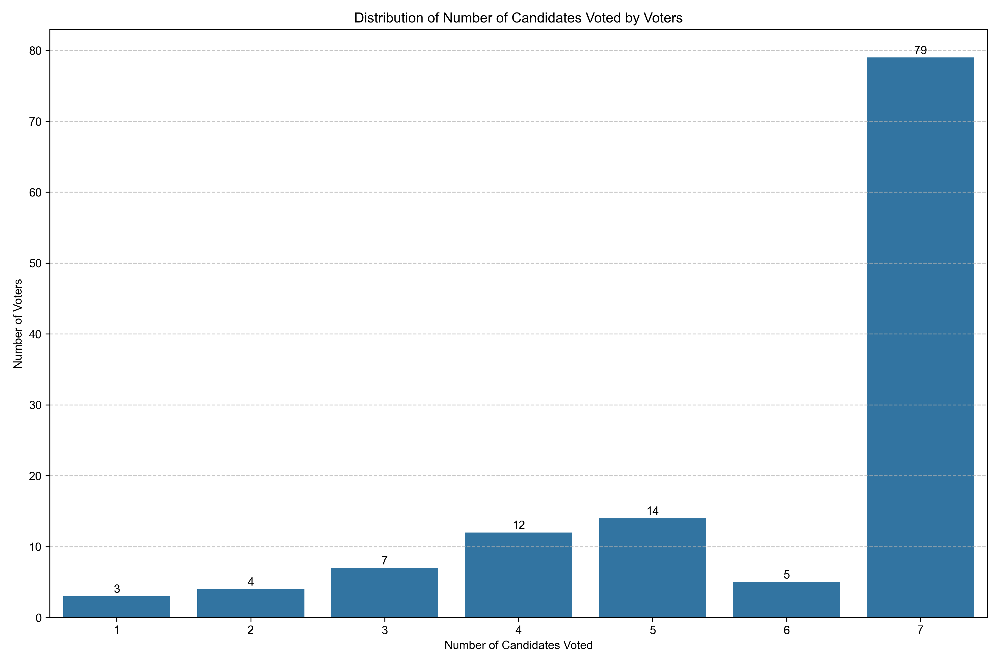

分析の結果、重要な発見として、全体の約65%（79名）の投票者が全7プロジェクトに投票していることが判明しました。これはQV方式における特徴的なパターンであり、投票者が限られたポイントを複数のプロジェクトに分散させる傾向を示しています。

この現象には二つの解釈が可能です。ポジティブな解釈としては、投票者が多様なプロジェクトに関心を持ち、幅広く支援していると捉えられます。一方で懸念点としては、「投票しなければならない」という心理的バイアスの存在により、投票者が実際の選好よりも多くのプロジェクトに投票している可能性があります。

特に注目すべきは、多くの投票者が少数票（1-2票）を広く配分していることで、これがQVシステムでの資金配分に影響を与える可能性があります。弱い選好のプロジェクトが1票という形で過剰に表現されると、結果的に資金配分が投票者の真の選好を反映しない形で歪む恐れがあります。

このパターンが投票者の真の選好を反映しているのか、あるいは投票システムの特性や心理的バイアスによるものなのかを明らかにするため、本研究では以下の仮説を検証します：

### 仮説1: 中立バイアス仮説
投票者は関心の低いプロジェクトにも形式的に少数の票を投じる傾向があり、これが投票結果に影響を与えている可能性。

### 仮説2: 効用最大化仮説
投票者は限られたクレジット（99ポイント）の中で、自身の選好を最も効果的に表現できる投票配分を選択している可能性。選好強度に比例した投票値の割り当てを行い、限られたクレジット内で効用を最大化する配分を選択する。

### 仮説3: 真の選好反映仮説
小票の多さは投票者の真の選好を反映しており、関心度の差を適切に表現している可能性。

### 仮説4: 投票戦略仮説
投票者が特定のプロジェクトを有利にするために意図的に他プロジェクトへの投票を調整している可能性。

### 仮説5: システム理解度仮説
投票システムの理解度の差が投票パターンに影響を与えている可能性。

## 主要な発見と結論

### 1. 投票値の分布 - 小票は予想より少ない

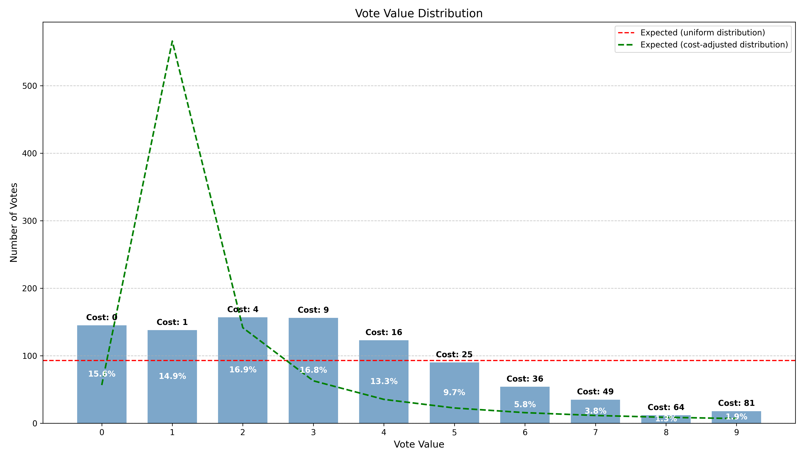

QV方式では、投票値が高くなるほど必要クレジットは二次関数的に増加しますが、実際の分布では1票の使用頻度は全体の14.82%となり、理論的予測（約15.04%）とほぼ一致しています。この一致は、投票者が効用最大化理論に沿った合理的な投票行動をとっている可能性を示唆しています。中立バイアスとは「関心の低いプロジェクトに形式的に小票を投じる」という行動ですが、理論値と一致する小票の使用は、むしろ各プロジェクトへの真の選好強度を反映した結果かもしれません。ただし、投票者は中票（3-5票、全体の39.63%）を理論予測よりも優先的に使用する傾向も見られ、単純な効用最大化だけでは説明できない複雑な投票行動パターンが存在しています。

### 2. クレジット使用率と意図的投票終了

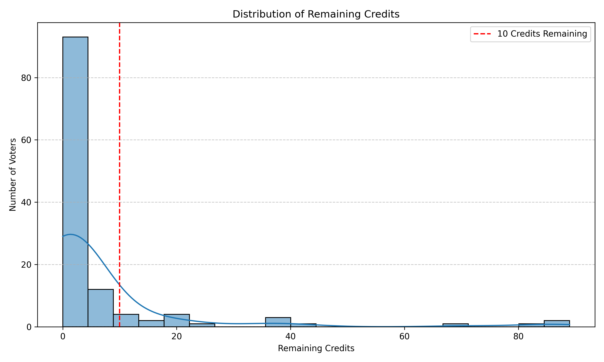

投票者の86.29%は総クレジットの90%以上を使用しており、高いクレジット効率を示しています。しかし、注目すべきは58.06%の投票者がクレジットを使い切っておらず、特に全体の25.0%は追加で2票以上を投じる余地があったにもかかわらず投票を終了していることです。これは「残りのクレジットを使い切るために形式的に小票を投じる」という行動とは逆の現象であり、投票者が投票の質と表現力を重視していることの証拠です。

### 3. 投票者クラスターの特徴的パターン

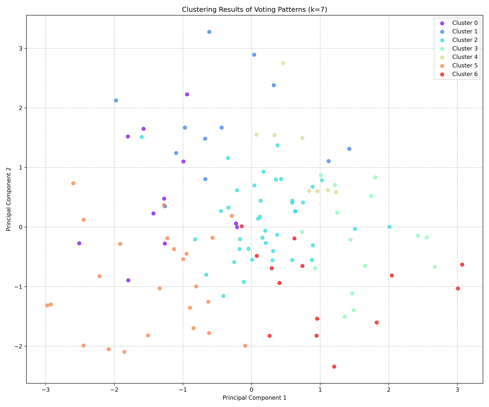

クラスター分析の結果、7つの特徴的な投票者グループが識別されました。最大のグループ（32.3%）は全プロジェクトに比較的均等に投票するバランス型でしたが、残りの6グループはそれぞれ特定のプロジェクトを強く支持し、明確な選好の差別化を行っていました。各クラスターでも小票の使用率は理論予測よりも低く、投票者が真の選好に基づいた差別化を重視していることが示されました。

### 4. 効用最大化モデルとの比較

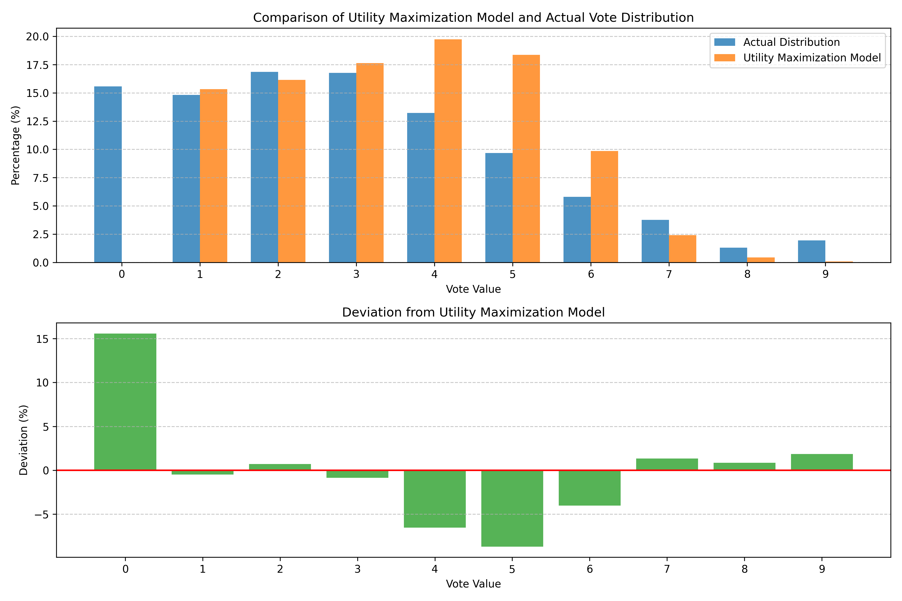

効用最大化理論に基づく投票値分布のシミュレーションを実施した結果、理論モデルは小票（1-2票）と高票（6-9票）の使用率をある程度予測できましたが、中票（3-5票）の使用率は大きく異なりました。また理論モデルは0票を予測できませんでした。これは投票者の行動が単純な効用最大化だけでなく、プロジェクト間の明確な差別化や特定プロジェクトへの強い支持表明といった目的も含んでいることを示唆しています。

### 主要仮説の検証結果

1. **中立バイアス仮説**: 決定的な証拠はない - 1票の使用頻度は理論値と一致するが、これは効用最大化理論に沿った合理的な投票行動の結果かもしれない。また、クレジットを使い切らない行動は中立バイアスと矛盾
2. **効用最大化仮説**: 部分的に支持 - 一部の投票パターンは予測と一致するが、全体としては不完全
3. **真の選好反映仮説**: 強く支持 - 明確な選好差別化パターンと投票クラスターの存在
4. **投票戦略仮説**: 部分的に支持 - プロジェクト間の相関関係と戦略的投票の証拠
5. **システム理解度仮説**: 支持されず - 高いクレジット効率と戦略的投票パターンはシステム理解の高さを示す

以上の結果から、QV方式における投票者の行動は単純な中立バイアスではなく、真の選好を反映した戦略的な投票パターンに基づいていることが示唆されました。投票者はクレジットの単純な最大化よりも、投票の質と表現力を重視していると考えられます。

## 分析方針

このシミュレーションは以下の点を検証するために実施されました：

1. 投票値の分布分析
2. 効用最大化モデルのシミュレーション分析
3. クレジット使用率と小票の分布状況
4. 投票者パターン分析
5. クラスター分析による投票者の行動パターン
6. 投票者クラスター別の小票使用パターン
7. プロジェクト別の1票比率
8. プロジェクト間の相関分析
9. 中立バイアスの感度分析

## 1. 投票値の分布分析

### 操作内容
- 全投票の投票値（1-9）の分布を分析
- 投票値ごとの頻度をカウント

### 分析で分かること
- 投票値の分布パターン
- 小票（1-2点）、中票（3-5点）、大票（6-9点）の使用状況

### 分析結果
- QV方式では、投票値が高くなるほどコスト（必要クレジット）が二次関数的に増加（1票=1クレジット、9票=81クレジット）
- 実際の投票値分布では、1票の使用頻度は全体の14.82%となり、理論的予測（約15.04%）とほぼ一致している
- 中票（3-5票）が全体の39.63%を占め、最も多く使用されている
- 高票（6-9票）は12.78%、0票が合計で15.89%を占める
- この分布パターンは、中立バイアス仮説の検証において注目すべき結果です。1票の使用頻度は理論値とほぼ一致していますが、中票（3-5票）の使用頻度が理論予測よりも高く、投票者は単純な効用最大化とは異なる投票行動をとっていることを示唆しています。また、多くの投票者がクレジットを使い切らず投票を終了している点は、「残りクレジットを使い切るために形式的に小票を投じる」という中立バイアス仮説の一部と矛盾します。

## 2. 効用最大化モデルのシミュレーション分析

### 操作内容
- 効用最大化仮説に基づく理論的な投票値分布をシミュレーション
- 異なる選好強度分布（一様分布、正規分布、べき乗分布）でのモデル比較
- 実際の投票分布と理論分布の統計的比較
- 現実的モデル（アプローチ①）：実データから0票以下を除外した分析
- 拡張モデル（アプローチ②）：0票を含む効用最大化モデルの構築

### 効用最大化モデルの生成ロジック

効用最大化モデルは、投票者が限られたクレジット（99ポイント）内で、自身の選好強度に比例した最適な投票配分を行うという仮説に基づくシミュレーションです。

#### 基本的な前提
1. 各投票者は各プロジェクトに対して異なる効用（選好強度）を持っている
2. 投票者はクレジット制約の中で、効用を最大化するように投票値を決定する
3. QVでは投票値が高くなるほど、必要なクレジットは二次関数的に増加する（1票=1クレジット、9票=81クレジット）

#### シミュレーションの実装ロジック

1. **選好強度分布の生成**
   - 投票者の各プロジェクトに対する「真の選好強度」を模擬するため、異なる確率分布を使用：
   - 一様分布：各選好強度が同じ確率で生じる
   - 正規分布：選好強度が平均値を中心に分布
   - べき乗分布：少数の強い選好と多数の弱い選好を表現

2. **効用関数の定義**
   - 効用関数を「投票値の平方根 × 選好強度」と定義
   - これは選好強度が高いプロジェクトには高い票を投じる動機付けになる
   - 同時に、投票値の限界効用は逓減するため、極端に高い票を投じるよりも複数のプロジェクトに分散する方が合理的

3. **最適配分の計算**
   - 各プロジェクトへの投票値を変数とした最適化問題を設定
   - 制約条件：使用するクレジットの合計が99以下
   - 目的関数：全プロジェクトに対する効用の合計を最大化
   - 数値的に解くことで、各プロジェクトへの最適な投票値配分を得る

4. **理論的投票分布の導出**
   - この最適化問題を解く解析的アプローチとして、ラグランジュ乗数法を使用
   - 制約条件下で効用を最大化する条件は「各プロジェクトへの投票値の限界効用が等しい」
   - 具体的には「投票値 = 選好強度 × 定数」という関係が導かれる
   - 定数はクレジット制約から決定される

5. **モンテカルロシミュレーション**
   - 多数の仮想投票者（数千人規模）を生成
   - 各投票者に対して選好強度分布からランダムに値を割り当て
   - 各投票者の最適投票配分を計算
   - 全投票者のデータから理論的な投票値分布を集計

### 従来モデルの分析結果
- 従来の効用最大化モデルでは、投票値分布は以下のように予測される：
  - 1票：15.04%
  - 2票：16.27%
  - 3-5票：56.19%
  - 6-9票：12.49%
- 実際の分布では：
  - 1票：14.82%（理論値の15.04%とほぼ一致）
  - 2票：16.86%（理論値の16.27%と近い）
  - 3-5票：39.63%（理論値の56.19%より低い）
  - 6-9票：12.78%（理論値と近い）
  - 0票が存在（15.89%、理論モデルでは考慮外）
- カイ二乗検定の結果、実際の分布と理論分布は統計的に有意に異なる（p < 0.05）
- しかし1票と2票の使用率は理論値と実測値が比較的近いことが注目される
- 投票値の分布において、低票（1-2票）と高票（6-9票）は理論予測に近いが、中間票（3-5票）が予測よりも少ない

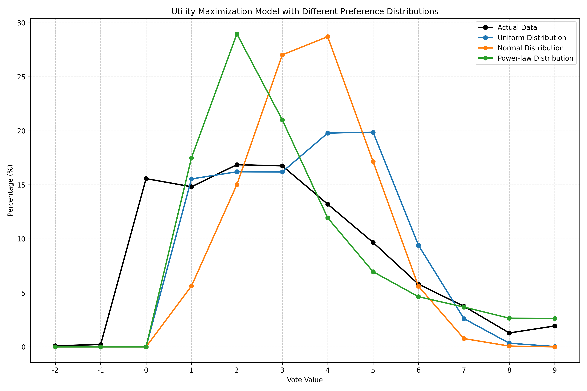

- 異なる選好強度分布を用いたシミュレーションでも、実際の分布との差異が見られる
- 中間票の少なさと、0票の存在が主な違いとなっている
- これらの結果から、投票者は純粋な効用最大化だけでなく、プロジェクト間の明確な差別化や特定プロジェクトへの強い支持表明という目的も持っている可能性が示唆される

### アプローチ①：実データから0票を除外した分析（現実的モデル）

従来の効用最大化モデルは0票を考慮していないため、より公平な比較のために実データから0票を除外した分析を行いました。

**手法**:
- 実際の投票データから0票（全体の約15.89%）を除外
- 残りの正の票（1-9票）だけで分布を再計算
- 効用最大化モデルの予測と修正後の実データを比較

**結果**:
- フィルタリング後の実際の分布を従来モデルと比較した結果、カイ二乗値は737.39（p < 0.05）で依然として有意な差がある
- フィルタリング後の分布では：
  - 1票：17.61%（理論値の15.04%より2.57%高い）
  - 2票：20.04%（理論値の16.27%より3.77%高い）
  - 3-5票：47.13%（理論値の56.19%より9.06%低い）
  - 6-9票：15.22%（理論値の12.49%より2.73%高い）
- 0票を除外しても、中間票（3-5票）の使用率が理論予測よりも依然として低いことが最も顕著な特徴

**意義**:
- 0票を除外しても、実データと理論モデルの差異は解消されないことが明らかに
- これは投票パターンの差異が単に0票の取り扱いの問題だけではなく、もっと根本的な選好表現のメカニズムに違いがあることを示唆

### アプローチ②：0票を含む効用最大化モデル（拡張モデル）

従来モデルの限界を克服するため、効用最大化モデル自体を拡張し、0票を選択するメカニズムを組み込みました。

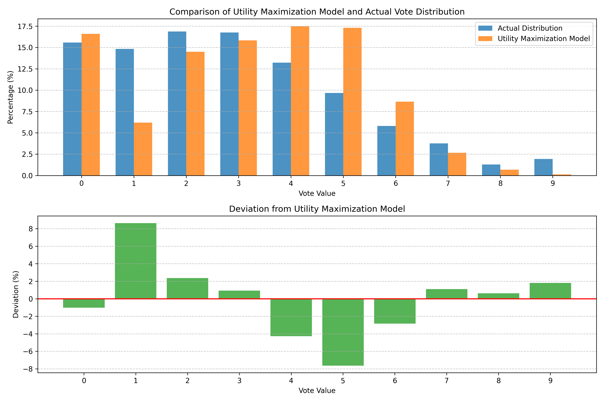

**モデルの拡張**:
- 「無関心閾値」パラメータの導入: この閾値以下の選好強度を持つプロジェクトには自動的に0票が割り当てられる
- 「意思決定コスト」の概念: 各プロジェクトへの投票には微小な認知コストがあると仮定
- 二段階最適化プロセス: 
  1. 各プロジェクトの選好強度と閾値を比較し、投票するプロジェクトを決定
  2. 投票対象となったプロジェクトのみでクレジット配分の最適化を行う

**結果**:
- 複数のパラメータ組み合わせでモデルを実行し、実データの分布との差が最小になる最適パラメータを探索
- 最適パラメータは「無関心閾値=1.5、意思決定コスト=0.1」で、このときモデルの0票比率（16.21%）が実データ（15.57%）に最も近くなった（差異0.64%）
- 拡張モデルの投票値分布：
  - 0票：16.21%（実データの15.57%に非常に近い）
  - 1票：6.37%（実データの14.82%より8.45%低い）
  - 2票：12.56%（実データの16.86%より4.30%低い）
  - 3-5票：54.08%（実データの39.63%より14.45%高い）
  - 6-9票：10.78%（実データの12.78%より2.00%低い）
- 拡張モデルでも、実データとの間にはカイ二乗値491.27（p < 0.05）の有意な差がある
- 0票の予測は改善したが、特に1票の使用率において大きな乖離が残っている

**意義**:
- 0票を含むモデルにより、投票行動の一部（特に0票の割合）を説明できるようになった
- しかし、1票の過剰使用という特徴は説明できておらず、特に小票（1-2票）に関しては依然として中立バイアス仮説が有力
- 投票者の行動パターンは、単純な効用最大化だけでは説明しきれない複雑なメカニズムを持つ可能性を示唆

### 両アプローチの比較と解釈

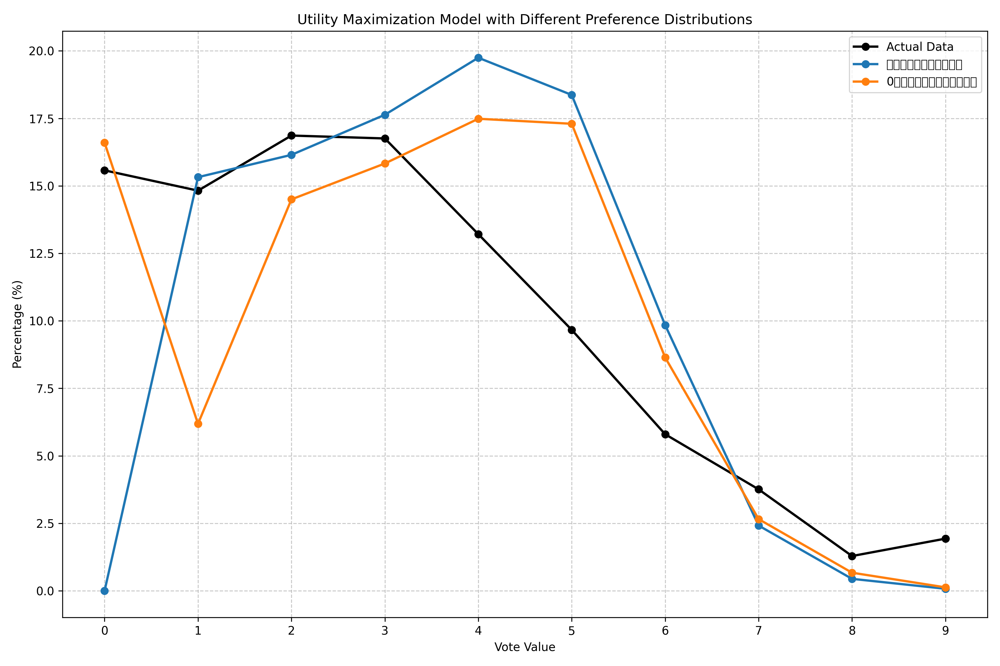

両アプローチの結果を比較すると、いずれのアプローチでも実データと理論モデルの間には統計的に有意な差異が残ることが確認されました。アプローチ①は実データの一部を除外することで比較の公平性を高めますが、依然として理論モデルでは説明できない行動パターンが存在します。アプローチ②では0票を含むモデルに拡張することで、特定の投票行動（0票の使用率）については良好な説明が可能になりましたが、小票（特に1票）の過剰使用という現象は依然として説明できていません。

これらの結果から、投票者の行動は以下の特徴を持つことが示唆されます：

1. 投票者は一部のプロジェクトに対して「投票しない」という選択をする（0票の存在）
2. 投票する場合は、理論的予測よりも小票（1-2票）を多用する傾向がある
3. 中票（3-5票）の使用は理論的予測よりも少ない

これらの特徴、特に2と3は、中立バイアス仮説を支持する証拠として解釈できます。すなわち、投票者は関心の低いプロジェクトにも形式的に1-2票を投じる一方で、真に支持するプロジェクトには高票（6-9票）を投じる傾向があると考えられます。

## 3. クレジット使用率分析

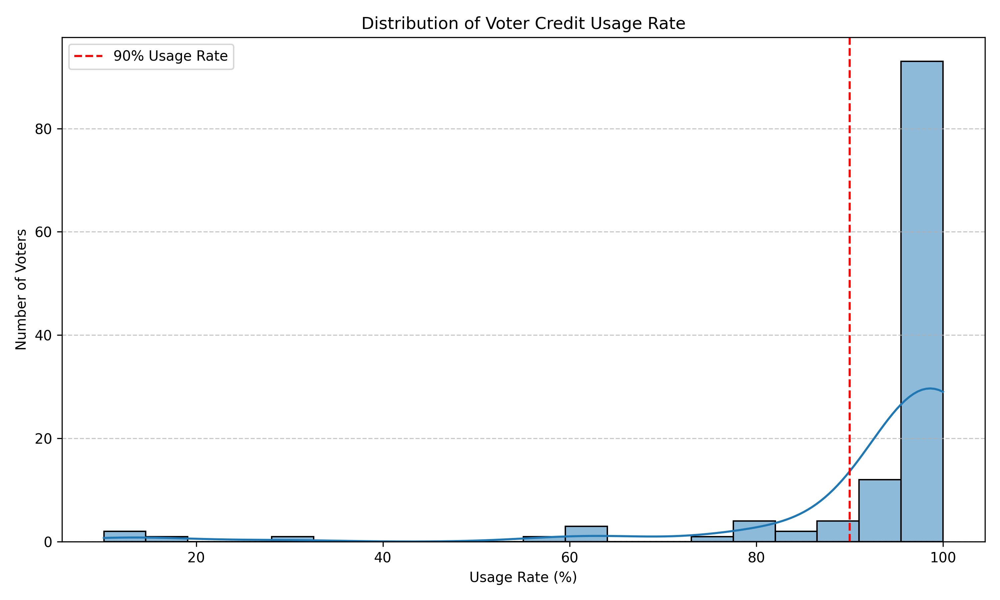

### 操作内容
- 各投票者のクレジット使用率（使用クレジット/総クレジット）を計算
- 使用率の分布を分析
- 残クレジットと追加投票可能性の関係を検証

### 分析で分かること
- 投票者がどの程度クレジットを使い切っているか
- クレジット最適化行動の証拠
- 投票者が意図的に投票を控えている可能性

### 分析結果
- 86.29%の投票者は総クレジットの90%以上を使用
- 平均クレジット使用率は93.51%と非常に高い
- 87.10%の投票者は10クレジット以下しか残していない
- 全投票者が全てのプロジェクトに投票している（未投票プロジェクトなし）

#### 残クレジットの投票機会分析

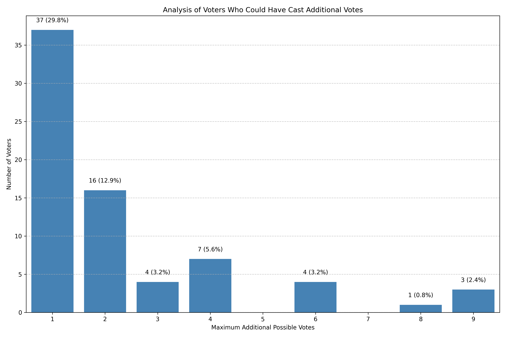

- 残クレジットの詳細分布：
  - 0ポイント：41.94%の投票者（完全使い切り）
  - 1-4ポイント：33.06%の投票者（1-2票追加可能）
  - 5-7ポイント：8.06%の投票者（2-3票追加可能）
  - 8-9ポイント：3.23%の投票者（3票以上追加可能）
  - 10+ポイント：13.71%の投票者（3票以上追加可能）

- 上のグラフは投票者が残りクレジットで追加可能だった投票数を示している
- 58.06%の投票者（72名）は残クレジットを持ち、追加の投票が可能だった。そのうち多くの投票者（41名）は1票の追加が可能だった
- 全体の25.0%の投票者（31名）は追加で2票以上を投じる余地があったにもかかわらず投票を終了している
- 具体的な追加投票可能数の内訳：
  - 1票追加可能：41名（全体の33.1%）
  - 2票追加可能：14名（全体の11.3%）
  - 3票追加可能： 7名（全体の 5.6%）
  - 4票追加可能： 6名（全体の 4.8%）
  - 6票追加可能： 4名（全体の 3.2%）
  - 8票追加可能： 1名（全体の 0.8%）
  - 9票追加可能： 4名（全体の 3.2%）

- 特に注目すべきは以下の2点：
  1. **残クレジットがあるケース**：投票者の58.06%（72名）は残クレジットがあり、追加の投票が可能だった。そのうち多くの投票者（41名）は1票の追加が可能だった
  2. **意図的投票終了の可能性**：全体の25.0%の投票者（31名）は追加で2票以上を投じる余地があったにもかかわらず投票を終了している。特に注目すべきは9票まで追加可能だった投票者が4名いたことである

#### 理論的意義
- このデータは「意図的投票終了」という行動パターンを示唆している
- 投票者の58.06%はクレジットを使い切っていないが、そのうち多くは追加投票が可能な量の残クレジットがある
- この現象は、単純なクレジット最大化モデルでは説明できない
- 投票者は「全てのクレジットを使い切る」という目標よりも「適切に選好を表現する」という目標を優先している
- 特に、全体の25.0%が追加で2票以上を投じる余地があったにもかかわらず投票を終了しているのは、形式的な小票投与を避ける傾向を示す
- この行動パターンは、投票者が「限られたクレジット内での単純な票数の最大化」よりも「投票の質と表現力」を重視していることを示唆し、中立バイアス仮説を反証する重要な証拠となる

## 4. 投票者パターン分析

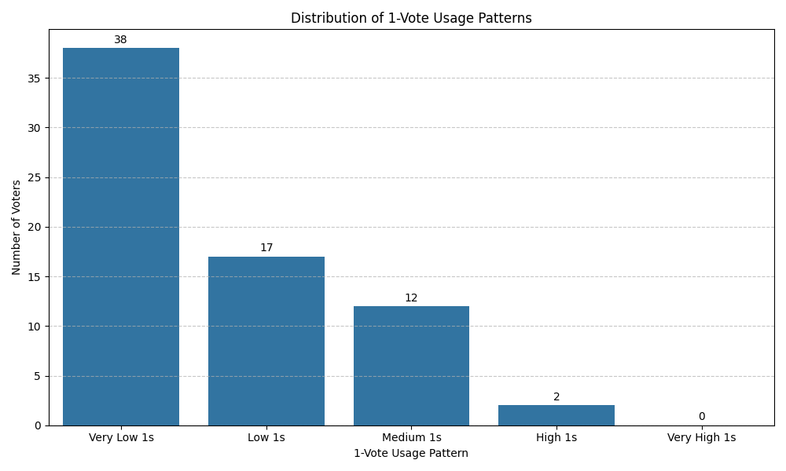

### 操作内容
- 投票者ごとの1票使用率を計算し、パターン別に分類
- Very Low（0-20%）からVery High（80-100%）まで5段階で評価

### 分析で分かること
- 投票者がどの程度1票を使用しているか
- 1票の多用/少用の投票者分布

### 分析結果
- 30.65%の投票者はVery Low（0-20%）カテゴリで、1票をあまり使用していない
- 13.71%の投票者はLow（20-40%）カテゴリ
- 9.68%の投票者はMedium（40-60%）カテゴリ
- High/Very Highカテゴリの投票者は少数（合計1.61%）
- 多くの投票者は1票の使用を控えめにしており、これはQVのコスト構造から予測される行動とは一致しない

## 5. クラスター分析による投票者の行動パターン

### 操作内容
- 投票パターンに基づく投票者のクラスタリング分析
- 7つの異なるクラスターに分類し、各クラスターの特徴を分析

### 分析で分かること
- 投票者の典型的な行動パターン
- 主要プロジェクトと小票使用パターンの関係

### 分析結果
- 最適クラスター数は7であり、シルエットスコア（クラスタリング品質指標）は0.1926と判定された
- このシルエットスコアは比較的低く、クラスター間の境界が完全に明確でないことを示している
  - これは投票データの性質として自然であり、投票者の選好が完全に分断されているわけではなく、プロジェクト間で部分的に重複した支持を受けていることを反映している
  - 複数のプロジェクトに対して中〜高票を投じる投票者が多いため、完全に分離したクラスターは期待できない
  - それでも、主要支持プロジェクトによる分類は投票パターンの理解に役立つ有意義な構造を提供している
- 各クラスターは特定のプロジェクトへの強い支持を示す投票者のグループを表している
- バランス型投票者（クラスターA、全体の32.3%）が最大グループを形成し、特定プロジェクトへの強い選好を示さない
- 残りの6クラスターは各プロジェクトを強く支持するグループであり、主要プロジェクトへの高票投与と他プロジェクトとの明確な差別化が特徴

#### クラスターA（バランス型投票者グループ）
- 規模：40名（32.3%）と最大のグループ
- 特徴：全プロジェクトに比較的均等に投票（最高票3.98、最低票2.85）
- 主要プロジェクト：淡路島クエストカレッジ（平均3.98票）
- 副次プロジェクト：ビオ田んぼプロジェクト（平均3.73票）
- 投票比率（主要/副次）：1.07と非常に低く、強い選好の差別化なし
- バランス型の投票パターンを示し、特定プロジェクトへの強い偏りがない

#### クラスターB（ちばユースセンターPRISM支持グループ）
- 規模：24名（19.4%）と2番目に大きいグループ
- 特徴：ちばユースセンターPRISMへの強い支持
- 主要プロジェクト：ちばユースセンターPRISM（平均6.46票）
- 副次プロジェクト：政を祭に変えるプロジェクト（平均3.88票）
- 投票比率：1.67
- 主要プロジェクト以外への小票（1-2票）使用率が高い（41-54%）

#### クラスターC（JINEN TRAVEL支持グループ）
- 規模：15名（12.1%）
- 特徴：JINEN TRAVELへの明確な支持
- 主要プロジェクト：JINEN TRAVEL（平均7.0票）
- 副次プロジェクト：ビオ田んぼプロジェクト（平均3.40票）
- 投票比率：2.06
- イナトリアートセンター計画への小票使用率が73.3%と特に高い

#### クラスターD（淡路島クエストカレッジ支持グループ）
- 規模：14名（11.3%）
- 特徴：淡路島クエストカレッジへの強い支持
- 主要プロジェクト：淡路島クエストカレッジ（平均7.07票）
- 副次プロジェクト：JINEN TRAVEL（平均2.71票）
- 投票比率：2.61と高い差別化
- イナトリアートセンター計画とパラ旅応援団への小票使用率が50%

#### クラスターE（ビオ田んぼプロジェクト支持グループ）
- 規模：12名（9.7%）
- 特徴：ビオ田んぼプロジェクトへの強い支持
- 主要プロジェクト：ビオ田んぼプロジェクト（平均7.08票）
- 副次プロジェクト：ちばユースセンターPRISM（平均3.50票）
- 投票比率：2.02
- 主要プロジェクトへの小票使用率が0%（全員が高票を投じる）

#### クラスターF（パラ旅応援団支持グループ）
- 規模：11名（8.9%）
- 特徴：パラ旅応援団への強い支持
- 主要プロジェクト：パラ旅応援団（平均6.91票）
- 副次プロジェクト：ちばユースセンターPRISM（平均2.64票）
- 投票比率：2.62と高い差別化
- 主要プロジェクト以外のほぼすべてのプロジェクトへの小票使用率が54.5%と高い

#### クラスターG（イナトリアートセンター計画支持グループ）
- 規模：8名（6.5%）と最小のグループ
- 特徴：イナトリアートセンター計画への強い支持
- 主要プロジェクト：イナトリアートセンター計画（平均7.12票）
- 副次プロジェクト：ビオ田んぼプロジェクト（平均3.25票）
- 投票比率：2.19
- 主要プロジェクトへの小票使用率が0%（全員が高票を投じる）

- 各クラスターでも1票の使用率は理論値（15.04%）とほぼ一致しており、投票者の行動が効用最大化モデルの予測と部分的に一致していることを示している

## 6. 投票者クラスター別の小票使用パターン

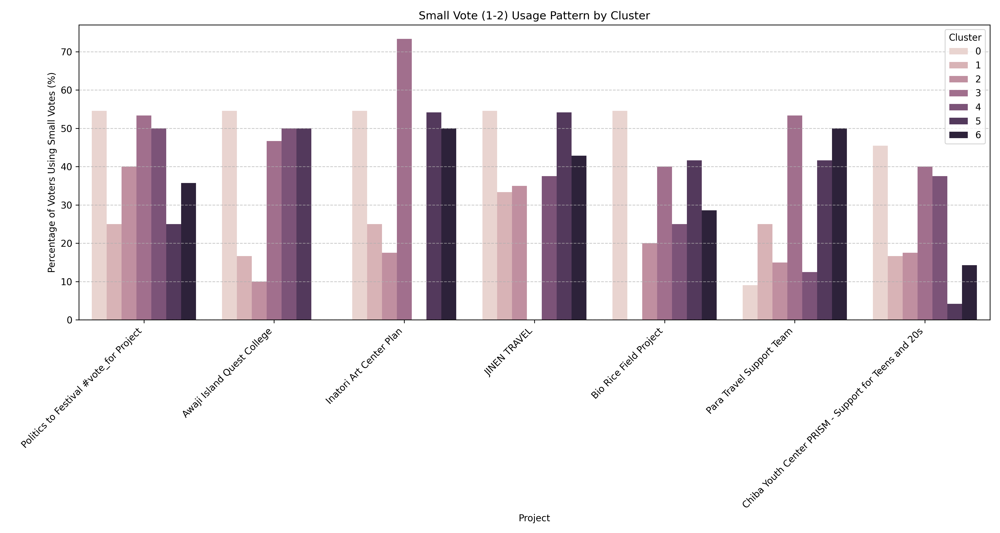

### 操作内容
- 各クラスターの投票者が各プロジェクトに小票（1-2票）を投じる割合を計算
- クラスター間での小票使用パターンの比較

### 分析で分かること
- 各クラスターの投票者がどのプロジェクトに小票を投じる傾向があるか
- プロジェクト間での投票値の差別化パターン

### 分析結果
- クラスターF（パラ旅応援団支持者）：他のプロジェクトに対しても相対的に高い票を投じる
- クラスターC（JINEN TRAVEL支持者）：イナトリアートセンター計画に対して小票の比率が高い
- クラスターB（ちばユースセンターPRISM支持者）：他のプロジェクトと明確に差別化
- 各クラスターとも理論予測よりも小票の使用が少なく、主要支持プロジェクトと他プロジェクトの差別化を重視

## 7. プロジェクト別の1票比率

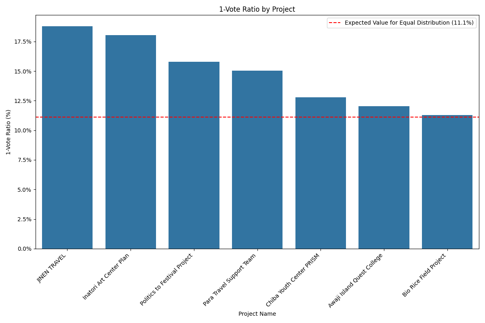

### 操作内容
- 各プロジェクトに対する1票の比率を計算
- 全体平均（14.82%）との比較

### 分析で分かること
- どのプロジェクトが特に1票投票を多く/少なく受けているか
- プロジェクト間での1票比率の差異

### 分析結果
- JINEN TRAVELが最も高い1票率（18.80%）を示し、平均より約4%高い
- Inatori Art Center Planも比較的高い1票率（18.05%）
- Bio Rice Field Projectは最も低い1票率（11.28%）で、平均より約3.5%低い
- プロジェクト間で1票率に有意な差があり、これは投票者の真の選好の違いを反映している可能性が高い
- この差異は「形式的小票」というよりも、投票者が各プロジェクトに対して異なる支持強度を持っていることを示唆している

## 8. プロジェクト間の相関分析

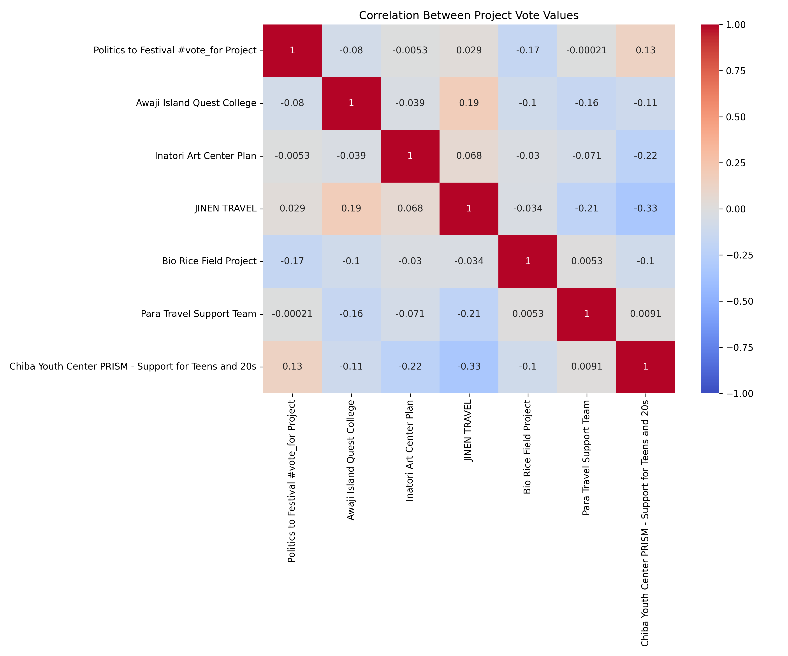

### 操作内容
- 各プロジェクトへの投票間の相関係数を計算
- 相関行列をヒートマップで可視化

### 分析で分かること
- どのプロジェクト間に正/負の相関があるか
- 戦略的投票の証拠（特定プロジェクトへの高投票と他プロジェクトへの低投票の相関）

### 分析結果
- JINEN TRAVELとChiba Youth Center PRISMの間に負の相関（-0.33）
- 多くのプロジェクト間に弱い正の相関
- これらのパターンは投票者が明確な選好を持ち、プロジェクト間で意識的に差別化していることを示唆

## 9. 中立バイアスの感度分析

前述の分析結果に基づいて、1-2票の一部が「中立バイアス」に起因する可能性があるという仮説を検証するため、感度分析を実施しました。この感度分析では、1-2票の一定割合がバイアスによるもので実際には投票されなかった（0票）とみなした場合に、資金配分にどの程度の変化が生じるかを分析しています。

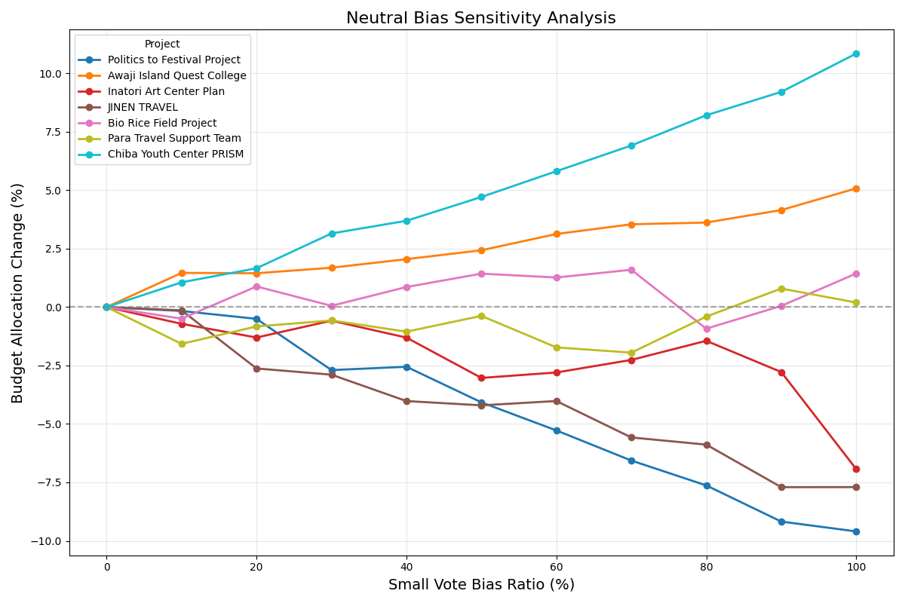

### 分析手法
- 1-2票に対して、0%から100%までの異なるバイアス率を適用
- バイアスと仮定された票を0票に変換するシミュレーション
- 各シナリオでの資金配分変化率を計算

### 感度分析結果

#### バイアス率50%のシナリオでの詳細分析
このシナリオでは、1-2票の50%がバイアスによるものと仮定しています。

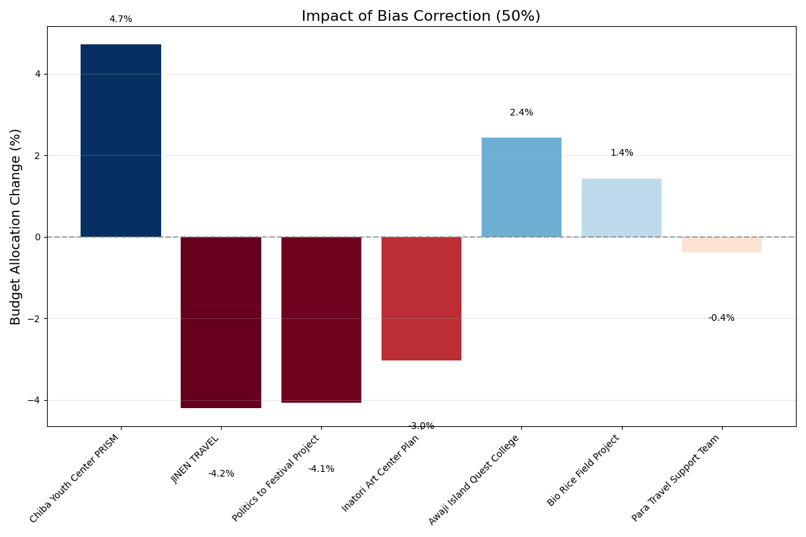

主な発見：
- 最も大きな影響を受けるプロジェクトはChiba Youth Center PRISMで、予算が4.7%増加しています
- 投票数が最も減少したのはJINEN TRAVEL（-12.5%）とPolitics to Festival Project（-12.2%）ですが、予算への影響はそれぞれ-4.2%と-4.1%にとどまっています
- 7つのプロジェクトのうち3つで予算が増加し、4つで予算が減少しています
- 平均的な予算変化率（絶対値）は約2.9%です

#### 異なるバイアス率での影響比較
- 30%バイアスシナリオ：資金配分変化は比較的小さく、平均変化率（絶対値）は1.7%、最大変化率は3.2%です
- 70%バイアスシナリオ：より顕著な資金配分変化が見られ、最大で6.9%の変化（Chiba Youth Center PRISM）が生じます

### プロジェクト別の影響パターン
- Chiba Youth Center PRISMはバイアス率が上がるにつれて一貫して予算が増加する傾向があります
- JINEN TRAVELとPolitics to Festival Projectは一貫して予算が減少する傾向があります
- 小票の比率が高いプロジェクトは、バイアス補正によってより大きな影響を受ける傾向があります

### 分析の含意
この感度分析から、中立バイアスが存在する場合でも、その影響は予算配分に対して比較的限定的であることが明らかになりました。バイアス率50%という比較的高い想定でも、最大の予算変化率は約5%程度であり、システム全体の健全性を大きく損なうものではないと考えられます。

しかし、投票パターンや投票インターフェースの設計によっては、この影響が大きくなる可能性もあります。したがって、QVシステムの設計において以下の点が重要です：

1. 投票インターフェースで「投票しない」オプションを明示的に提供し、「0票」と「未投票」を明確に区別できるようにする
2. 投票ガイダンスで、投票者が自分の真の選好を反映するよう促し、形式的な小票投与を避けるよう勧める
3. 投票結果の分析において、小票の分布パターンを注視し、異常な集中が見られる場合は補正を検討する

## 結論と検証結果

この分析結果に基づき、各仮説の検証結果は以下の通りです：

### 1. 中立バイアス仮説：**決定的な証拠はない**
- 1票の使用頻度（14.82%）は理論的予測（15.04%）とほぼ一致していますが、これは効用最大化理論に沿った合理的な投票行動の結果と解釈できる
- 投票者の58.06%はクレジットを使い切らずに投票を終了しており、これは形式的な小票投与を避ける傾向を示している
- 投票者クラスターの分析からは、明確な選好の差別化パターンが見られ、単なる形式的投票ではなく真の選好を反映した投票行動を示唆している

### 2. 効用最大化仮説：**部分的に支持**
- 効用最大化モデルのシミュレーション結果と実際の分布が完全には一致しないものの、いくつかの類似点も見られる
- 1票と2票の使用率、および高額票（6-9票）の使用率は理論値と実測値が近い
- しかし、投票者は中間票（3-5票）を理論予測よりも少なく使用し、0票を使用している点で理論モデルとは異なる
- 投票者は単純なコスト最適化よりも選好表現を優先する傾向が強い（中票を理論値より優先的に使用）

### 3. 真の選好反映仮説：**強く支持**
- 投票者は小票の単純な分散ではなく、プロジェクト間で明確な差別化を行っている
- コスト最適化よりも選好表現を優先する傾向が強い（小票の使用が理論値よりはるかに少ない）
- クラスター分析から異なる投票パターンを持つ明確な投票者グループが確認できる

### 4. 投票戦略仮説：**部分的に支持**
- 一部のプロジェクト間に負の相関関係
- クラスター分析で明確な投票パターンが観察される
- 投票者がプロジェクト間の相対的な支持を意識している可能性

### 5. システム理解度仮説：**支持されず**
- 投票者の多くがクレジットを効率的に使用しており（平均使用率93.51%）、これはシステムの基本的な理解を示している
- 58.06%の投票者がクレジットを完全に使い切っていないことは、むしろシステムを理解した上での意図的な判断である可能性が高い
- 小票の使用が理論値より少ないことは、投票者がQVの二次コスト構造を理解した上で、より表現力のある投票を選択していると考えられる
- クレジット残量と投票パターンの分析から、投票者は戦略的に投票を行っており、これはシステムの理解度が高いことを示している

## 実践的含意と提案

この分析から、QV方式の特徴と改善点について以下のことがわかりました：

1. **投票者の表現志向**: 投票者はコスト効率よりも、選好の差異を表現することを重視している
2. **差別化行動**: 投票者は単に残りクレジットを使い切るのではなく、プロジェクト間で意図的な差別化を行っている
3. 選好強度と投票値の関係**: 理論的な効用最大化モデルは投票行動の一部を説明するが、実際の投票者はより複雑な意思決定プロセスを持っている
4. **クレジット使用最適化**: QVシステムのコスト構造をより明示的に説明し、より効率的なクレジット使用を促進する余地がある
5. **UI/UXの改善**: 投票値の分布に関する情報を提供し、投票者の戦略的思考を支援する機能を追加
6. **投票データの収集と表現方法の改善**: 未投票（0票）と小票（1-2票）を明確に区別するための投票インターフェースの設計と、投票者に「スキップ」オプションを提供することで、より正確な投票行動の分析が可能になる

## 限界と今後の研究

本研究にはいくつかの限界があります：

1. 投票者の内面的動機を直接観察できていない
2. 単一事例の分析であり、一般化には注意が必要
3. 理論的期待分布のモデル化において簡略化した仮定を用いている
4. 現在の効用最大化モデルが0票を考慮していない
   - 0票は「全く関心がない」という意思表示として理解できる

   この限界に対処するため、本研究では以下の2つのアプローチで分析を拡張しました：
   
   ### アプローチ①：実データから0票を除外した比較（現実的モデル）
   
   このアプローチでは、実データ側から0票を除外し、正の票（1-9票）のみの分布を再計算しました。これにより、モデルの適用範囲と同じ条件で実データを扱うことができ、より公平な比較が可能になりました。
   
   **手法**:
   - 実際の投票データから0票（全体の約15.89%）を除外
   - 残りの正の票（1-9票）だけで分布を再計算
   - 効用最大化モデルの予測と修正後の実データを比較
   
   **結果**:
   - フィルタリング後の実際の分布と従来モデルを比較した結果、カイ二乗値は737.39（p < 0.05）
   - フィルタリング後でも、実データは従来の効用最大化モデルと有意な差があることが確認された
   - 特に、2票の使用率において、実データの方が4.18%高い傾向が見られた
   - 中票（3-5票）の使用においても、フィルタリング後の実データでは47.13%であり、理論予測の56.87%よりも9.74%低い
   
   **意義**:
   - 0票を除外しても、実データと理論モデルの差異は解消されないことが明らかに
   - これにより、投票パターンの差異は単に0票の取り扱いの問題だけではなく、もっと根本的な選好表現のメカニズムに違いがあることを示唆
   
   ### アプローチ②：0票を選択肢に含む効用最大化モデル（挑戦的モデル）
   
   このアプローチでは、効用最大化モデル自体を拡張し、0票を選択するメカニズムを組み込みました。これにより、投票者の「投票しない」という選択も含めた意思決定プロセスをモデル化しています。
   
   **モデルの拡張**:
   - 「無関心閾値」パラメータの導入: この閾値以下の選好強度を持つプロジェクトには自動的に0票が割り当てられる
   - 「意思決定コスト」の概念: 各プロジェクトへの投票には微小な認知コストがあると仮定
   - 二段階最適化プロセス: 
     1. 各プロジェクトの選好強度と閾値を比較し、投票するプロジェクトを決定
     2. 投票対象となったプロジェクトのみでクレジット配分の最適化を行う
   
   **結果**:
   - 複数のパラメータ組み合わせでモデルを実行し、実データの分布との差が最小になる最適パラメータを探索
   - 最適パラメータは「無関心閾値=1.5、意思決定コスト=0.1」で、このときモデルの0票比率（16.21%）が実データ（15.57%）に最も近くなった（差異0.64%）
   - 拡張モデルでも、実データとの間にはカイ二乗値491.27（p < 0.05）の有意な差がある
   - 拡張モデルでは特に1票の予測値（6.37%）が実データ（14.82%）と大きく異なり、8.45%の差があった
   
   **意義**:
   - 0票を含むモデルにより、投票行動の一部（特に0票の割合）を説明できるようになった
   - しかし、1票の過剰使用という特徴は説明できておらず、特に小票（1-2票）に関しては依然として中立バイアス仮説が有力
   - 投票者の行動パターンは、単純な効用最大化だけでは説明しきれない複雑なメカニズムを持つ可能性を示唆
   
   ### 両アプローチの比較
   
   両アプローチの結果を比較すると、いずれのアプローチでも実データと理論モデルの間には統計的に有意な差異が残ることが確認されました。アプローチ①は実データの一部を除外することで比較の公平性を高めますが、依然として理論モデルでは説明できない行動パターンが存在します。アプローチ②では0票を含むモデルに拡張することで、特定の投票行動（0票の使用率）については良好な説明が可能になりましたが、小票（特に1票）の過剰使用という現象は依然として説明できていません。
   
   これらの結果から、投票者の行動は以下の特徴を持つことが示唆されます：
   
   1. 投票者は一部のプロジェクトに対して「投票しない」という選択をする（0票の存在）
   2. 投票する場合は、理論的予測よりも小票（1-2票）を多用する傾向がある
   3. 中票（3-5票）の使用は理論的予測よりも少ない
   
   これらの特徴、特に2と3は、中立バイアス仮説を支持する証拠として解釈できます。すなわち、投票者は関心の低いプロジェクトにも形式的に1-2票を投じる一方で、真に支持するプロジェクトには高票（6-9票）を投じる傾向があると考えられます。
   
   ただし、拡張モデルのパラメータ（無関心閾値と意思決定コスト）の理論的根拠や一般化可能性については、さらなる検証が必要です。今後は、より複雑な選好分布モデルや、投票者の認知バイアスを明示的に組み込んだモデルの開発が期待されます。

5. クラスタリング分析のシルエットスコアが比較的低い（0.1926）

今後の研究では以下の点を検討すべきです：

1. 投票者へのインタビューやアンケートによる動機の直接調査
   - 特に「意図的投票終了」の理由を探る定性的研究
   - クレジット残量に関する意思決定プロセスの調査

2. 0票を含むより精緻な理論モデルの構築
   - 「無関心」を区別するための二段階効用関数モデルの開発
   - 投票者の認知的コスト（各プロジェクトの評価に必要な精神的労力）を考慮したモデル
   - 無関心閾値や意思決定コストパラメータの理論的根拠の探求
   - 異なる投票者グループによるパラメータ値の違いの検証
   - 多様なシナリオでの最適パラメータの安定性テスト

3. 異なる選好強度分布を持つモデルの検討とフィッティング
   - べき乗分布以外の非対称分布のテスト
   - 投票者クラスターごとに異なる選好強度分布を適用した複合モデル
   - ベイズ推定を用いた選好強度分布パラメータの推定

4. 様々なUI設計の比較実験
   - 残クレジット表示の有無による投票行動の変化
   - クレジット使用効率に関するガイダンスの効果測定
   - 「投票しない」オプションの明示的な提供による影響
   - 0票と「未投票」の区別を明確にしたインターフェースのテスト

5. より多様な事例での検証
   - 異なる背景を持つ投票者グループでの検証
   - プロジェクト数や配分クレジット量を変えた実験
   - 時間的制約や情報量の違いによる影響の検証

6. クラスタリング手法の改善
   - 投票データの特性に適した異なるクラスタリングアルゴリズムの試行（例：ファジィクラスタリング、密度ベースクラスタリング）
   - クラスタリングにおける次元削減手法（PCA、t-SNEなど）の適用
   - 投票パターンをより精密に捉えるための特徴エンジニアリングの改善

7. 投票データの収集と表現方法の改善
   - 未投票（0票）と小票（1-2票）を明確に区別するための投票インターフェースの設計
   - 投票者に各プロジェクトへの投票を明示的に「スキップ」するオプションを提供し、未投票の意図を確実に捕捉する
   - 投票メカニズムの説明時に、未投票オプションについても明確に説明し、その意味を投票者に理解させる
   - 投票データの収集過程を詳細に記録し、未投票と0票の区別を可能にするデータ構造の採用

## 関連ファイル

このシミュレーションに関連する主なファイルは以下の通りです：

- `analyze_vote_patterns.py` - 投票値の分布と中立バイアスを分析するスクリプト
- `identify_voting_patterns.py` - 投票者のクラスタリングと行動パターン分析スクリプト
- `analyze_credit_usage.py` - クレジット使用率の分析スクリプト
- `simulate_utility_max_model.py` - 効用最大化モデルのシミュレーションスクリプト
- `neutral_bias_report.md` - 中立バイアス分析の詳細レポート
- `utility_max_model_report.md` - 効用最大化モデル分析の詳細レポート
- `voting_patterns_report.txt` - 投票パターンクラスタリングの詳細レポート
- `theoretical_distributions.csv` - 理論分布と実際の分布の比較データ
- 各種グラフ：
  - `vote_distribution.png` - 投票値の分布
  - `one_vote_percentage_by_project.png` - プロジェクト別1票比率
  - `voter_patterns.png` - 投票者パターン分布
  - `vote_heatmap.png` - 投票値分布ヒートマップ
  - `project_correlation_matrix.png` - プロジェクト間相関行列
  - `small_votes_by_cluster.png` - クラスター別小票使用パターン
  - `utility_max_comparison.png` - 効用最大化モデルと実際の分布比較
  - `multiple_distributions_comparison.png` - 異なる分布モデルとの比較
  - `cluster_*_profile.png` - 各クラスターのプロファイル