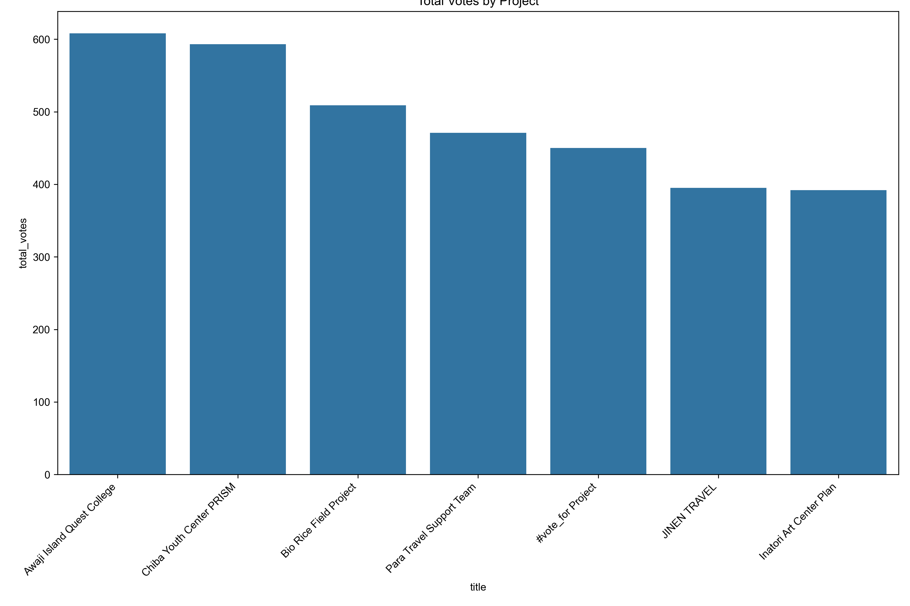

# Quadratic Voting 分析レポート

このドキュメントでは、Quadratic Voting（二次投票、QV）方式による投票結果の分析をまとめています。Beyond Conference 2025でのソーシャルセクター若手起業家向け資金配分プロジェクトの投票データを分析し、QV方式の特徴と効果を明らかにします。

## 分析概要

本分析では、[qv.geek.sg](https://qv.geek.sg)を使用して実施された二次投票の結果を分析し、以下の点を明らかにしています：

1. 各プロジェクトの得票状況と支持傾向
2. 投票者行動パターンの特徴
3. QV方式による最適な予算配分
4. 従来の一人一票方式との比較（別ドキュメント参照）

## 基本統計情報

### プロジェクト別の投票結果

| プロジェクト名 | 得票数 | 予算配分(円) | 割合(%) |
|-------------|-------|---------|------|
| Chiba Youth Center PRISM | 477 | 44,347 | 17.7% |
| Awaji Island Quest College | 430 | 39,978 | 16.0% |
| Bio Rice Field Project | 415 | 38,583 | 15.4% |
| Para Travel Support Team | 373 | 34,678 | 13.9% |
| Inatori Art Center Plan | 337 | 31,331 | 12.5% |
| JINEN TRAVEL | 330 | 30,681 | 12.3% |
| #vote_for Project | 327 | 30,402 | 12.2% |

### 投票者統計

- **総投票者数**: 124名
- **総投票数**: 783票
- **投票者あたり平均支持プロジェクト数**: 6.31
- **投票者あたり平均使用ポイント**: 21.65
- **最多得票プロジェクト**: Chiba Youth Center PRISM (477ポイント)
- **最多投票者数プロジェクト**: Chiba Youth Center PRISM (117投票者)

## プロジェクト別詳細分析

### Chiba Youth Center PRISM
- **総得票数**: 477
- **投票者数**: 117
- **平均投票値**: 4.08
- **中央値**: 4.0
- **最頻値**: 3
- **標準偏差**: 2.13
- **投票値域**: 1-9
- **予算配分**: 44,347円 (17.7%)

### Awaji Island Quest College
- **総得票数**: 430
- **投票者数**: 115
- **平均投票値**: 3.74
- **中央値**: 4.0
- **最頻値**: 4
- **標準偏差**: 1.94
- **投票値域**: 1-9
- **予算配分**: 39,978円 (16.0%)

### Bio Rice Field Project
- **総得票数**: 415
- **投票者数**: 114
- **平均投票値**: 3.64
- **中央値**: 3.0
- **最頻値**: 2
- **標準偏差**: 1.95
- **投票値域**: 1-9
- **予算配分**: 38,583円 (15.4%)

### Para Travel Support Team
- **総得票数**: 373
- **投票者数**: 114
- **平均投票値**: 3.27
- **中央値**: 3.0
- **最頻値**: 3
- **標準偏差**: 1.90
- **投票値域**: 1-9
- **予算配分**: 34,678円 (13.9%)

### Inatori Art Center Plan
- **総得票数**: 337
- **投票者数**: 108
- **平均投票値**: 3.12
- **中央値**: 3.0
- **最頻値**: 2
- **標準偏差**: 1.87
- **投票値域**: 1-9
- **予算配分**: 31,331円 (12.5%)

### JINEN TRAVEL
- **総得票数**: 330
- **投票者数**: 104
- **平均投票値**: 3.17
- **中央値**: 3.0
- **最頻値**: 2
- **標準偏差**: 2.09
- **投票値域**: 1-9
- **予算配分**: 30,681円 (12.3%)

### #vote_for Project
- **総得票数**: 327
- **投票者数**: 111
- **平均投票値**: 2.95
- **中央値**: 3.0
- **最頻値**: 2
- **標準偏差**: 1.60
- **投票値域**: 1-9
- **予算配分**: 30,402円 (12.2%)

## 主な分析結果

### 1. 得票数と予算配分の関係

QV方式では、得票数に応じて予算が配分されますが、線形ではない特徴的な配分方式となっています。上位プロジェクトと下位プロジェクトの予算配分の差は比較的小さく、全てのプロジェクトが一定以上の予算を確保できています。

### 2. 投票パターン分析

投票パターンの分析からは、以下の点が明らかになりました：

- 多くの投票者が複数のプロジェクトに分散して投票している
- 完全に票を集中させる投票者は少数派である
- 特定のプロジェクト間で相関関係が見られる（似たタイプのプロジェクトへの投票傾向）

### 3. プロジェクト別投票パターン

各プロジェクトの投票パターン分析から、投票者がどのように「投票強度」を表現しているかが見えてきます：

投票強度の分布は、プロジェクトによって異なるパターンを示しています：

- **強い支持層を持つプロジェクト**: 高い投票値（7-9）の割合が多い
- **幅広い支持層を持つプロジェクト**: 中程度の投票値（4-6）が広く分布
- **弱い支持を多数集めるプロジェクト**: 低い投票値（1-3）の数が多い

## QV方式の有効性

本分析から、QV方式の主な利点として以下の点が示されました：

1. **選好強度の表現**: 投票者は単なる賛否だけでなく、選好の強さを表現できる
2. **バランスの取れた資源配分**: 全てのプロジェクトが一定の予算を確保できる
3. **少数派の声の反映**: 強い選好を持つ少数派の声も意思決定に反映される
4. **投票のコスト意識**: 強い選好に対しては「コスト」がかかる仕組みにより、より真剣な投票行動を促進

## 結論

Quadratic Voting方式は、Beyond Conference 2025のような多様なプロジェクトへの資金配分において、従来の一人一票方式よりも公平で効果的な意思決定メカニズムを提供していることが確認できました。投票者の選好強度を反映しつつ、全てのプロジェクトが一定の支援を受けられる配分方式は、社会的意思決定の質を高める可能性を示しています。

## 関連ファイル

この分析に関連する主なファイルは以下の通りです：

- **データファイル**:
  - `voting_statistics.csv` - 投票統計データ
  - `vote_summary_with_budget.csv` - 予算配分を含む投票サマリー
  - `project_name_mapping.txt` - プロジェクト名のマッピング

- **レポート**:
  - `statistics_report.txt` - 詳細な統計レポート
  - `statistics_report.html` - HTML形式の統計レポート
  - `results_summary.txt` - 結果概要
  - `budget_allocation_table.txt` - 予算配分表

- **可視化**:
  - `budget_allocation.png` - 予算配分グラフ
  - `total_votes.png` - 総投票数グラフ
  - `candidate_correlation.png` - 候補者間相関図
  - `voters_voting_pattern.png` - 投票者の投票パターン
  - 各候補者の投票パターングラフ (`vote_pattern_candidate_X.png`)

また、別フォルダ（`comparison_simulation/`）には、QV方式と一人一票方式の詳細な比較分析も含まれています。 