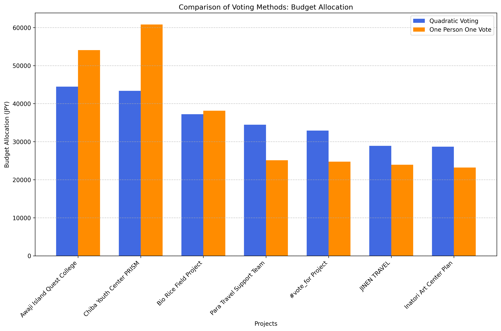
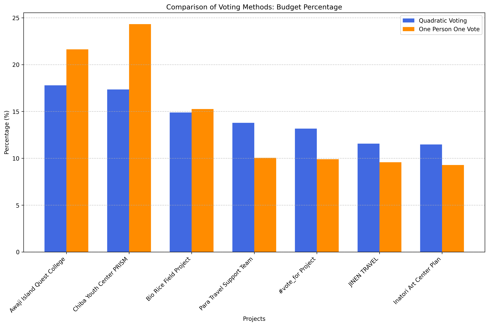
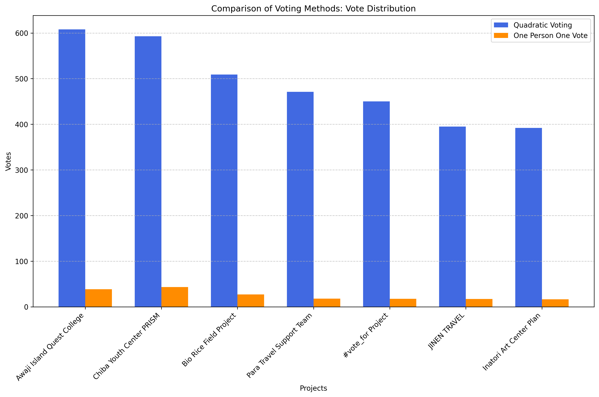

# Quadratic Voting vs. One-Person-One-Vote Analysis

このドキュメントでは、二次投票（Quadratic Voting, QV）方式と従来の一人一票（One-Person-One-Vote, OPOV）方式の比較分析結果をまとめています。様々な可視化手法を通じて、QV方式がどのように投票者の「選好の強さ」を反映し、より公平な予算配分を実現するかを示しています。

## シミュレーションの概要

このシミュレーションでは、実際の投票データをもとに「もし一人一票方式だったら」という仮想シナリオを作成し、QV方式との違いを分析しています。シミュレーションでは、各投票者が最も高い点数を入れたプロジェクトに一票を投じたと仮定し、その結果と実際のQV方式での結果を比較しています。

## 分析方針

このシミュレーションは以下の点を検証するために実施されました：

1. 投票強度（選好の強さ）を表現できる仕組みが結果にどう影響するか
2. 予算配分の公平性（ジニ係数による不平等度の測定）
3. 少数派の声が反映される度合い

## 1. 埋もれた声の可視化

### 操作内容
- 各投票者の「最大投票」を特定し、それ以外の強い選好（4以上のスコア）で投票したプロジェクトをカウント
- これにより、一人一票方式ではカウントされない「埋もれた声」を可視化

### 分析で分かること
- 一人一票方式では反映されない「強い選好」の数を定量的に把握できる
- どのプロジェクトが「埋もれた声」を多く持つかを視覚化

### 分析結果
- **全プロジェクトの埋もれた声の合計は202票で、全体の投票の約26%を占める**
- Chiba Youth Center PRISMは35票もの「埋もれた声」を持ち、最も多い
- Bio Rice Field Projectは37票、Para Travel Support Teamは26票の埋もれた声がある
- Awaji Island Quest Collegeは33票、#vote_for Projectも22票の埋もれた声がある
- これらの埋もれた声はQV方式では適切に反映されるが、一人一票方式では完全に無視される

### 計算方法

「埋もれた声」は、4以上の票数でかつ最大投票の候補ではない場合としてカウントしました。計算プロセスは以下の通りです：

1. 各投票者について、最大投票値とその候補を特定
2. 同一投票者の他の候補への投票のうち、4以上の票数を持つものを「埋もれた声」としてカウント
3. これにより、一人一票方式では無視されるが、QV方式では反映される「強い選好」を定量化

### 確率論的アプローチによる拡張分析

この基本計算に加えて、同点最高位の場合の処理をより精緻にするため、確率論的アプローチによる分析も実施しました。

この方法では：
1. 投票者が複数の候補に同じ最高得点を投じている場合（例：候補AとBに共に9票）、各候補が選ばれる確率を均等に配分します（例：AとBがそれぞれ50%の確率で選ばれる）
2. 最高得点の候補については、「選ばれない確率」に応じて埋もれた声として計上します
   - 例：候補AとBに9票ずつ投じた場合、Aは50%の確率で選ばれず、その場合は埋もれた声となる
3. 最高得点ではない候補については、100%埋もれた声としてカウントします

この確率論的アプローチを適用すると、埋もれた声の総数はさらに増加し、約226票（全体の約29%）に達することが明らかになりました。

### プロジェクト別の埋もれた声

| プロジェクト | 票数 | 割合 |
|------------|------|-----|
| Bio Rice Field Project | 37 | 18.3% |
| Chiba Youth Center PRISM | 35 | 17.3% |
| Awaji Island Quest College | 33 | 16.3% |
| Inatori Art Center Plan | 29 | 14.4% |
| Para Travel Support Team | 26 | 12.9% |
| #vote_for Project | 22 | 10.9% |
| JINEN TRAVEL | 20 | 9.9% |
| **合計** | **202** | **100%** |

この分析により、QV方式が一人一票方式では完全に無視される「埋もれた声」を適切に拾い上げ、集合的意思決定の質を高めていることが明確になりました。

## 2. 投票強度の分布ヒートマップ

### 操作内容
- 各プロジェクトと投票強度（0-9）のマトリックスを作成し、各セルに該当する投票者数を表示
- カラーグラデーションで投票数の多さを視覚化

### 分析で分かること
- 各プロジェクトに対する投票強度の分布パターンを把握できる
- 一人一票方式では最高強度（9）の投票のみが反映されることを明示

### 分析結果
- 投票者は様々な強度でプロジェクトを評価しており、単純な「賛成/反対」の二択ではない
- Chiba Youth Center PRISMは高強度（7-9）の投票が多い一方、中程度の強度（4-6）でも支持を集めている
- JINEN TRAVELは中程度の強度（4-6）での支持が比較的多い
- 一人一票方式では、これらの豊かな情報が失われ、最高強度の投票のみが反映される

## 3. 選好強度の比較

### 操作内容
- QV方式の投票を選好強度によって3段階（弱：1-3、中：4-6、強：7-9）に分類し積み上げグラフで表示
- 一人一票方式の投票数と並べて比較

### 分析で分かること
- QV方式が捉える選好強度の分布と、一人一票方式で反映される投票の違いを直接比較できる
- どのプロジェクトが「強い選好」を持つ支持者に支えられているかを把握できる

### 分析結果
- 一人一票方式では、Chiba Youth Center PRISMが最も多くの票を獲得
- QV方式では、強い選好だけでも一人一票方式の総票数を上回るプロジェクトがある
- 全体的に見て、QV方式はより多様な選好強度を反映し、少数派でも強い選好を持つプロジェクトを適切に評価している

## 4. 予算配分の比較

### 操作内容
- 得票数に応じた予算配分額をQV方式と一人一票方式で計算
- 各プロジェクトの予算配分額を棒グラフで比較

### 分析で分かること
- 投票方式の違いが実際の予算配分にどのような影響を与えるかを把握できる
- どのプロジェクトがQV方式で有利/不利になるかを確認できる

### 分析結果
- 一人一票方式では上位プロジェクト（特にChiba Youth Center PRISM）に予算が集中する傾向がある
- QV方式ではより均等な予算配分が実現し、上位と下位の差が小さくなる
- Para Travel Support TeamとInatori Art Center Planは一人一票方式よりもQV方式で多くの予算を獲得

## 5. ジニ係数による不平等度分析

### 操作内容
- 各投票方式による予算配分のジニ係数（不平等度の指標）を計算
- 両方式のジニ係数を比較

### 分析で分かること
- 予算配分の不平等さを客観的な数値で比較できる
- 値が低いほど平等な配分、高いほど不平等な配分を意味する

### 分析結果
- QV方式のジニ係数: 0.0774
- 一人一票方式のジニ係数: 0.2013
- QV方式は一人一票方式よりも約62%低いジニ係数を示し、より平等な予算配分を実現している

## 6. ローレンツ曲線

### 操作内容
- 両投票方式の予算配分に基づいてローレンツ曲線を作成
- 完全平等線（45度線）からの乖離度を比較

### 分析で分かること
- 予算配分の不平等度を視覚的に把握できる
- 曲線が45度線から離れるほど不平等度が高いことを示す

### 分析結果
- QV方式のローレンツ曲線は45度線に近く、より平等な予算配分を示している
- 一人一票方式のローレンツ曲線は明らかに45度線から離れており、不平等度が高い
- この視覚化からも、QV方式がより公平な予算配分を実現することが確認できる

## 7. パーセンテージ比較

### 操作内容
- 総予算に対する各プロジェクトの配分比率（％）を計算
- QV方式と一人一票方式の配分比率を比較

### 分析で分かること
- 両投票方式の予算配分パターンを相対的に比較できる
- どのプロジェクトが相対的に多く/少なく予算を獲得するかを把握できる

### 分析結果
- 一人一票方式では、上位プロジェクト（Chiba Youth Center PRISM）が25%の予算を獲得
- QV方式では、最大のシェアでも17.7%にとどまり、より平等な配分となっている
- QV方式では相対的に低評価のプロジェクトも一定の予算シェアを確保できている

## 8. 得票数比較

### 操作内容
- QV方式と一人一票方式での得票数を棒グラフで比較
- 得票パターンの違いを視覚化

### 分析で分かること
- 両投票方式がプロジェクトの人気度をどう評価するかの違いを把握できる
- 投票者の選好がどのように反映されているかを比較できる

### 分析結果
- QV方式では全てのプロジェクトが一定の得票数を確保しており、相対的な差が小さい
- 一人一票方式ではChiba Youth Center PRISMが突出して高い得票を得る一方、#vote_for Projectなどは低い得票にとどまる
- これは一人一票方式が「多数決」の性質を持つのに対し、QV方式は「選好強度」も考慮することの違いを示している

## 結論

この比較分析から、QV方式は従来の一人一票方式と比較して以下の利点を持つことが明らかになりました：

1. **選好強度の反映**: 投票者がどれだけ強くプロジェクトを支持するかを適切に反映できる
2. **埋もれた声の救済**: 一人一票方式では無視される強い選好を持つ少数派の声を反映できる
3. **より公平な予算配分**: ジニ係数やローレンツ曲線で示されるように、より平等な予算配分を実現
4. **多様な意見の尊重**: 異なる強度の選好を持つ投票者の意見を幅広く政策決定に反映できる

QV方式は、直接民主制における投票の質を高め、より公平で豊かな集合的意思決定を可能にする革新的手法であると言えます。 

## 関連ファイル

このシミュレーションに関連する主なファイルは以下の通りです：

- `compare_voting_methods.py` - 比較シミュレーションを実行するPythonスクリプト
- `voting_methods_comparison.csv` - QV方式と一人一票方式の比較データ
- `one_person_one_vote_results.csv` - 一人一票方式のシミュレーション結果
- `voting_methods_comparison_report.txt` - 詳細な比較レポート
- 各種グラフ：
  - `buried_voices.png` - 「埋もれた声」の可視化
  - `preference_intensity_heatmap.png` - 選好強度の分布ヒートマップ
  - `preference_intensity_comparison.png` - 選好強度と一人一票の比較
  - `voting_methods_vote_comparison.png` - 投票数の比較
  - `voting_methods_budget_comparison.png` - 予算配分の比較
  - `voting_methods_percentage_comparison.png` - パーセンテージの比較
  - `voting_methods_gini_comparison.png` - ジニ係数の比較
  - `lorenz_curves.png` - ローレンツ曲線（不平等度可視化） 